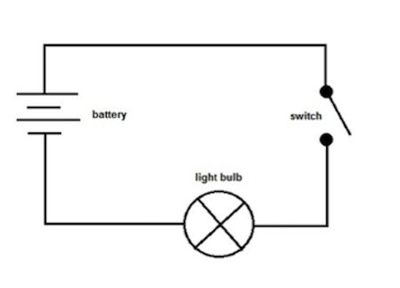
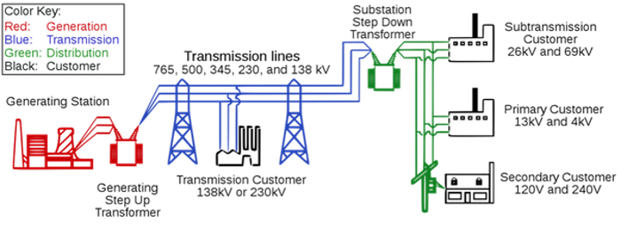
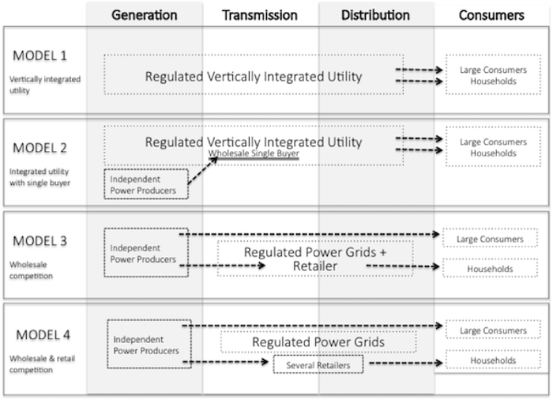

#  Electric power systems

## Learning objectives

This chapter provides a very short introduction into the basic terminology and workings of electric power systems. By the end of the chapter you should be able to:
*	Understand basic concepts and terminology of electricity
*	Familiarize yourself with the physical setup of an electric power system
*	Get familiar with the electricity industry and its “value chain”: generation, transmission, distribution and retail supply of electricity
*	Get a brief idea about how to electricity industry evolved and what is driving the change now

### 1.	Electricity: basic terminology

Electricity is the movement of electrons along electrical conductors (wires) that form a closed circuit. In itself, electricity is not that useful, but it is valuable as a source of energy. It is also easier and more convenient to transport electricity than other energy carriers over long distances and it is versatile in the sense that it is readily convertible into other forms of energy like heat, light and mechanical energy.

**Measuring electricity.** Since electricity is a form of energy like heat, it can be measured and ex-pressed in similar terms. The conventional unit of measuring any type of energy is joule (J). Related to this is the concept of power, which is the rate at which energy is delivered. Mathematically power is equal to the quantum of energy delivered divided by the time in which it was delivered.  Power is measured in watts (W), where one watt is equal to one joule of energy delivered in one second.

	energy = power × time	(1)

**Watt-hours.** In practice, electrical energy or electricity is often not expressed in joules but rather by referring to power. Conventionally electricity is measured in Watt-hours (Wh) with one watt-hour being equal to the amount of energy delivered by one watt in one hour. But one Wh is an extremely small quantum of energy in practical applications in power systems. Therefore kilowatt-hours (1 kWh = 1000 Wh) or megawatt-hours (1 MWh = 1000 kWh) are used. Very high quantum of electricity is measured in gigawatt-hours (1 GWh = 1000 MWh) and terawatt-hours (1TWh = 1000 GWh).

|  Appliance |   Wattage    |
|---|---|
| Cellphone  |  1 W |
| Laptop computer  |  25 W |
|  LCD Television |  150 W |
| Dishwasher  | 330 W  |
| Solar module on single-family home  |  10 kW |
|  Instantaneous water heater |  20 kW |
| Large solar power plant  | 100 MW  |
| Large coal power plant  |  1 GW |
| Peak load in Germany  | 100 GW  |

**Electrical circuit.** Electricity flows through electrical circuits, usually conductors (wires) made of copper or aluminum. A simple electrical circuit would like one shown in *Figure 1* in which a light bulb is connected to a source of electricity through wires. The symbols used in that figure are standardized [electric symbols](https://en.wikipedia.org/wiki/Electronic_symbol)

**Figure 1:** A simple electrical circuit

**Key point:** Key ideas used when describing electrical circuits are voltage, current and power.

Source: [Physics Stack exchange](https://physics.stackexchange.com/questions/178009/how-does-electric-energy-flow-in-a-circuit)

**Power, voltage and current.** The rate at which the bulb consumes electrical energy (power) in such a circuit can be expressed in terms of the voltage drop across the bulb and the current flowing through the wires. If the voltage drop across the bulb is a hundred volts (100 V) and the current flowing through the light bulb is one ampere (1 A), then the rate at which the bulb consumes electrical energy is equal to 100 W. This can be generalized: power (measured in Watts, W) is equal to voltage drop across the element (measured in volts, V) times the electric current (I) flowing through it (measured in amperes, A).

	power = voltage × current	(2)

**Energy loss in electrical circuits.** When electricity flows through a substance, including electric wires and cables, some of it is lost (in the form of heat) due to the “resistance” offered by the substance. Think about electric current as water flowing through a pipe and resistance as the friction offered by the pipe to the flowing water. Resistance offered by a conductor is measured in Ohms (Ω). Mathematically, the energy loss is roughly proportional to square of the current flow. In other words, by cutting the current by 50%, energy loss can be reduced by 75%.

	Energy lost = current^2 × resistance	(3)

We saw earlier that, for a given value of power, voltage is inversely proportional to current (power is equal to voltage times current, so for the same value of power current is equal to power divided by voltage). This implies that electrical energy lost in a circuit, for a given power delivered and a given resistance, is inversely proportional to the square of voltage.

	Energy lost = current^2  × resistance = resistance /voltage^2	(4)

**Reducing losses through high voltage.** For a given amount of power, increasing the voltage by a factor of 10 reduces the current by a corresponding factor of 10 and therefore the losses approximately by a factor of 100, provided the same sized conductors are used in both cases. We said earlier that electrical energy is more useful than other forms of energy because it can be transported over long distances quite easily. But this is true only when electricity is transmitted across wires at high voltage; at lower voltages energy loss would be substantial and it would not be economical to transfer energy over long distances.

**High voltage: a safety issue.** The benefit of reduced energy loss at high voltages comes at the cost of increased danger of physical harm due to electric current. You need keep a minimum distance of 4m between yourself and a conductor loaded with 400 kV. Such safety measures are both impractical and costly for handling electricity at home. An optimal solution is to have an electricity system that transmits electricity over long-distances at high voltages while connecting end-consumers to the system at low voltages. This is accomplished using a device called power transformer using which voltage can be easily increased or decreased within an electrical system.

**AC vs. DC power.** The first power systems developed in the late 19th century provided electricity operated at a constant voltage: these are known as direct current or DC systems. Today, direct current is used within electronic devices such as computers, but not in power systems as a whole. Rather, alternating current or AC systems are used that are based on a voltage that varies in a constant, regular way. The rate at which AC voltage varies is known as frequency and is expressed in hertz (Hz). Most power systems in the world operate at either 50 Hz or 60 Hz, which means that the “direction” of voltage is reversed 50 (or 60) times per second. The frequency of current has to be maintained at a constant level throughout the electrical system as large deviations from the frequency, at which electrical appliances and systems are designed to operate, can damage them.

**Why do we use AC power?** Why do most power systems work on the complicated AC voltage when simple DC systems are known. The reasons lie in the advantages and disadvantages of high voltage. AC systems are widely used because through power transformer voltage can be easily increased or decreased within an electrical system. By contrast, it is much more complicated to “step up” (increase) or “step down” (decrease) the voltage of DC current (in fact, it is usually converted in AC, transformed, and converted back). This is the reason that AC systems outcompeted DC ones in the 20th century, using transformers such that voltage can be stepped up to allow transmission at high voltages to reduce energy loss, and voltage can be reduced at the consumption point for safe use.

### 2. Physical setup of electric power systems

**Electric power systems.** A complex network of interconnected electrical equipment and circuits is deployed to enable supply and use electricity. Collectively, this equipment makes up the electric power system. Today electric power systems are often large, stretching over thousands of kilometers and deliver electricity to hundreds of millions of consumers. (In contrast, the power system of a small island is many orders of magnitude smaller.) The overall working of the system can be simplified as follows: electricity is produced at large power plants, transmitted over long distances through the transmission system and brought to the consumers through the distribution system. *Figure 2* provides a schematic view of such an electrical system. Historically, such a system emerged, as it was economical to build big power plants near the source of energy (coal mines, rivers etc.) and use transmission and distribution system to transfer the electricity produced to consumers.

**Figure 2:** Schematic view of a classical electric power system
**Key point:** An electrical system is usually divided into generation, transmission and distribution functions.

Source: [Wikipedia](https://en.wikipedia.org/wiki/Electric_power_transmission)

**Generation.** Power plants are the production centers of electrical systems. A big power plant usually consists of several smaller generating units, each of which consists of two basic components: a turbine that produces rotary motion and a generator that converts this mechanical energy of rotation into electrical energy. Different technologies and energy sources can produce this rotation motion. In a thermal power plant pressurized steam, which is produced by heating water through combustion of coal, natural gas, or biomass, or nuclear fission, or solar heat, fuels this motion. In certain natural gas-based thermal plants the pressure of hot gasses produced during combustion drives the rotor (these “gas turbines” work just like jet engines of aircrafts). In wind or hydro power plants, the pressure of wind or water against the rotor moves it. The one exception is the solar photovoltaic (PV) generation technology, which is distinctly different from the traditional generators as it directly converts light energy to electricity, without using a turbine or a generator.

**Installed capacity.** Each generating unit in a power plant has an installed or nameplate capacity, which is its maximum mega-watt (MW) electrical power capacity that the unit can generate. Corresponding to this generation capacity is the actual electrical generation, which is measured in megawatt hour (MWh). Remember that one MWh is equal to the amount of electricity generated by a generating unit with a capacity of one mega-watt running continuously for one hour.  

	Electrical generation (G)=capacity (C)  × time	(5)

Where G is generation in mega-watt hours (MWh), C is capacity in mega-watt (MW) and time is hours for which the generating unit is run. Note that, because the year has 8760 hours, a one mega-watt generating unit can generate a maximum of 8760 MWh of electricity during a year. Practically, actual electrical generation from a unit is lower than its installed capacity and is measured by electrical meters. Power stations are explained in more detail in Power plants.

**Transmission.** Transmission and distribution systems are the means of transferring electricity from power stations to load (consumption) centers. They differ however in the voltage levels of operation, with transmission typically being above 220 kV (the exact voltage of demarcation differs by country and systems); the voltages are very high to reduce the energy loss in long distance transmission of electricity. The transmission system consists of transmission lines, substations and system services. Sub-stations are facilities that comprise a range of equipment, including switches and power transformers. The transmission system is like a mesh spread over hundreds of kilometers and is commonly referred to as the transmission grid/network. Flow of electricity through the transmission grid can be stylized as follows: electricity is fed into the grid at power plants; electricity flows towards consumption (load) centers; sub-stations near the load centers “step down” the voltage and feed power into the distribution system to be delivered to consumers. But the stylized picture is overly simplistic because:

* There are many power plants and many consumers in the system
* There are usually many “paths” from a given power plant to the load centers (because of the meshed structure of the grid)
* Laws of physics govern flow of electricity and not contracts between power plants and consumers

These complications will be discussed in detail in Chapter *Power grids.* One important system service is balancing energy, which will be discussed in Chapter *Balancing.*

**Contingencies.** This makes managing flow of electricity across the transmission grid a complex task. The transmission grid is like a highway network crisscrossing a country. There is more than one route between two points and traffic is flowing on all routes. If for some reason one road is blocked, there is a jam till the order is restored. Traffic flows on alternative routes that get more crowded (overloading of transmission lines) and these alternative routes may develop jams as well. Thus a problem in the network can spread and cause breakdown of the entire system. Because electrons flowing through the transmission lines travel at much higher speeds than cars, breakdowns can occur in a matter of seconds. Transmission systems need to be built and managed to handle such eventualities to ensure continuous flow of electricity to consumers.

**Distribution.** The distribution system consists of electric lines, substations and cables reaching all the way to the consumers. Distribution has two distinct functional components – distribution and supply. “Distribution” refers to the physical network through which electricity is transferred from the transmission system to end consumers. “Supply” refers to the commercial activities related to selling power to consumers, including metering, contracting and billing.

**Organizing power systems.** The institutional relationship between generation, transmission and distribution systems is determined by the market structure of the electricity industry. The legal system also puts restrictions on ownership of the different functions – supply and distribution are jointly operated as a single function in many areas, while that might not be the case in other locations.

### 3.	Market structure of electricity industry

The ways the electricity industry is organized varies greatly across the world and has changed over the course of history. To see their differences, it makes sense to think about the industry in terms of different functions of steps in the value chain: generation, transmission, distribution, and retail sup-ply. These can be either provided by one firm or by separate firms; and they can be working under competition or as regulated monopolies.

**Vertically integrated electricity utilities.** Until the 1990s electricity utilities everywhere were essentially structured as vertically integrated, regulated monopolies. This meant that the same entity owned production, transmission, distribution and retail supply of electricity in a given area, and it had no competitors. Such a structure allowed the utility to design and operate a system that benefits from the “economies of scale” and systemic interactions present in large-scale electrical systems; it also allowed for integrated generation and grid planning. To ensure that the monopolist electricity utility would not charge a price that was unreasonably higher than the costs of production, retail prices were set by regulatory bodies, usually on the basis of “cost-of-service” regulation. The regulators also set conditions for service of supply. Rather than regulating a large private monopoly, many countries nationalized the entire industry and brought it under direct state control. Vertically integrated utilities are still found in several OECD countries (such as parts of the United States) and are the norm in most developing countries. This traditional regulated utility structure worked reasonably well, at least in the beginning. It drove down the cost of electricity, fostered universal access and provided for reliable electric service delivered by a single utility in a given region. But there were inefficiencies in the model: it was difficult to set a “fair” price through regulations, lack of competitive pressure on costs and, more importantly, lack of incentives for innovation. This, along with a general movement towards deregulation, prompted a re-think in the 1980s.

**Restructuring electricity utilities.** Through the 1980s and 1990s many industries were liberalized round the world, from postal services and telecommunications to utilities. Steps were taken in several countries to “restructure” electricity utilities, i.e. to split integrated utilities in parts and allow competition in segments of the industry. The path followed varied – the eventual structures that emerged in the different regions of the United States were different, which were again at variance from the model adopted by the European Union. The underlying logic of the new structures was however similar.

**Competitive generation and wholesale markets.** In most countries, the generation function was the first to be liberalized. Generation activity was de-licensed and thrown open to free entry to encourage greater competition and incentivize investments in the sector. While earlier most power plants were owned by one or several big utilities, the new structure encouraged investors to setup “merchant power plants” or “independent power producers” (IPPs) that were not tied to a particular utility. Such power plants compete with each other to sell power in the (newly created) “wholesale market” for electricity. It was envisaged that greater competition in generation would encourage investment and practices to make power plants more efficient. As hoped, prices declined significantly in many markets in the aftermath of liberalization.

**Unbundling.** In many cases, competition in generation was accompanied or followed by separating (“unbundling”) the generation business of existing vertically integrated utilities from the rest of the company. This was done to ensure that transmission operators do not discriminate against power plants that were not owned by the vertically integrated utility. Sometimes, the generation business was split into several smaller companies to foster competition.

**Grids: natural monopolies.** In the new structure generation companies compete in the market. But transmission and distribution systems are still monopolies. This is because they are natural monopolies: electricity grids exhibit economies of scale i.e. it is more economical for one company to set up one electricity grid rather than building parallel grids. Transmission and distribution companies are allowed to charge a fix, regulated fee for operating the grid and are required to provide non-discriminatory services to all generators and consumers.

**Retail competition.** Along with generation, supply of electricity is no longer a monopoly in many countries. In such countries a distinction is made between the “distribution” and “retail supply” components of the distribution system. A retail supplier of electricity typically procures power from the wholesale market and manages metering, contracting, billing and collection of payment from end consumers. Suppliers are sometimes also called “load serving entities”, and are the face of the electricity industry to the ordinary consumers. Consumers are free to choose from a set of suppliers in the market who compete amongst each other to provide the best service to end consumers. The segregation between distribution and supply is however not universal. Even several markets that restructured generation (allow competition) and transmission (require non-discriminatory services) of electricity retain the regulated monopoly structure of distribution and supply of electricity.

**Figure 3.** Different Market Structures in electricity
**Key point:** Electricity markets have evolved from the vertically integrated model. Many, somewhat varying structures are currently in operation across geographies.

Source: Own figure

**Market models.** Figure 3 illustrates typical ways of organizing electricity markets. In Model 1 (Vertically integrated utility) a single utility operates generation, transmission and distribution (including retailing) business; the utility may be either a regulated private corporation or state-owned entity. In Model 2 (Integrated utility with single buyer), independent power producers are allowed to operate, which sell electricity to the utility through an intervening agency called a “single buyer” under long-term contracts called power purchase agreements (PPAs). The terms and conditions of PPAs in a single buyer market are often subject to regulation. In Model 3 (Wholesale competition), large consumers are allowed to buy electricity directly from generators, i.e. there is no single buyer anymore. The regulated utility continues to supply all smaller customers. In Model 4 (Wholesale and retail competition), all consumers can pick a supplier: large consumers will buy directly at the wholesale market while small consumers choose a retail supplier. Transmission and distribution remains regulated.

**Different wholesale markets.** There exist at least two flavors of competitive wholesale markets: the American “central dispatch” model of an Independent System Operator that conducts security-constraint economic dispatch, and the European “self-dispatch” model where wholesale market participants interact on power exchanges and through brokers. The European market model is discussed in detail in *Markets and institutions for electricity: Europe* and the American model is discussed more briefly in *The global diversity in market models.*

### 4.	Renewables in the electric power systems

In the last two decades concern regarding the environmental impact of fossil fuel based generation technologies has prompted a policy shift towards promotion of wind and solar generation. This coupled with decline in cost has led to a significant increase in the share of renewables in the global energy mix, a trend that is expected to continue or even accelerate.

**Figure 4.** Capacity additions in OECD Europe
**Key point:** In historical perspective, the rise of renewables is impressive.

Source: OEE based on IEA data

The growth of wind and solar generation sources raises two issues that may once again fundamentally change the structure of the electricity industry and the electric markets. First stems from the economic and technical management of renewable energy, which is available only when the sun shines or the wind blows. As the share of renewables in the system increases, it significantly alters the economics of electricity industry. This point is discussed further in *The Economics of renewable energy.* Second is the growth of distributed generation resources that are on the property of the end user. These resources can be a solar panel on someone’s rooftop or, maybe in the not so distant future, someone’s electric car that stores electricity and feeds it back to the grid when required. Such “Prosumers” are discussed in *Auto-generation and prosumers.* Both these changes may shape the economics and structure of electric power systems of the future.
