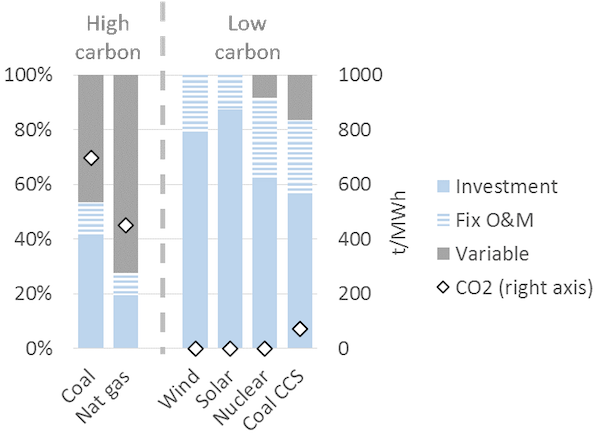
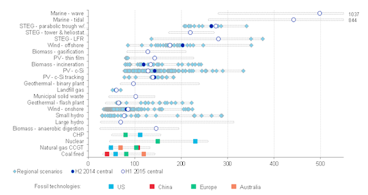
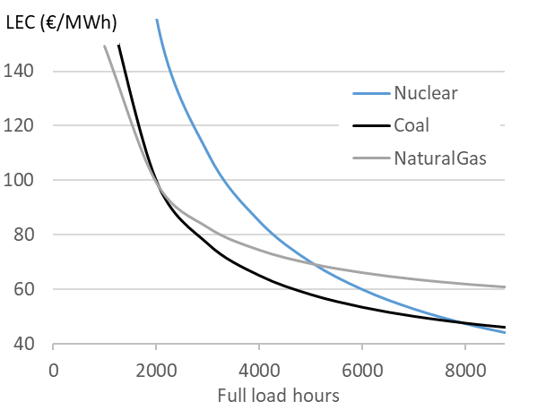
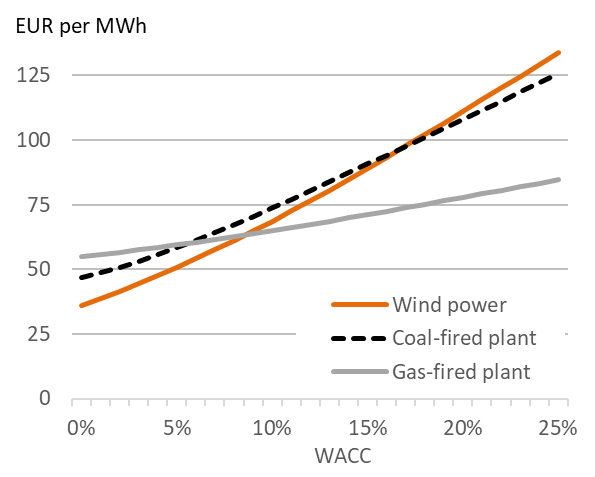
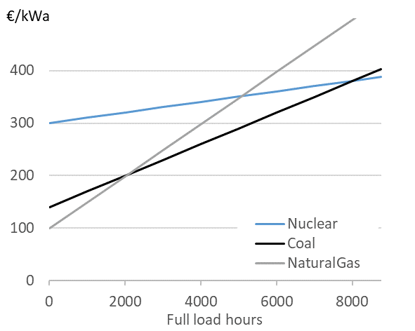

# The cost of electricity

### Learning objectives

This chapter gives an overview of the cost of electricity generation. We will discuss the cost structure, cost level of various generation technologies, and learn different cost metrics. At the end of the chapter you should be able to:

* Differentiate between fixed and variable costs of electricity generation
* “Annualize” one-off investment cost
* Calculate “levelized cost of electricity” (LCOE)
* Understand how the LCOE is used, and occasionally misused
* Create “screening curves”
* Use such screening curves to determine the least-cost generation technology
* Understand the difference between short-term and long-term profits

## 1. Cost of generating electricity

Let us start with two simple questions: How much does it cost to produce electricity, and which is the least-cost technology to produce it? In this chapter, we want to answer these questions. It will turn out that these answers are more complicated than you might expect.

Like other economic goods, generation of electricity requires land, labor, raw material and capital, which imply an intrinsic cost of production. For example, electricity generated using a coal-based power plant first requires the coal power plant to be built, for which an investor might bear the cost of the land, equipment, construction, grid connection, financing and project management. In addition to this there are further costs involved in running the power plant: the cost of coal that is burnt and expenses, including labor cost, to keep the plant up and running. While the actual costs involved in electricity generation vary with the technology used, we can nevertheless build a general understanding of costs associated with electricity generation.

### 1.1 Fixed and variable costs of generation    

Broadly speaking all generation costs can be categorized into two groups depending on the point in time at which those costs are incurred: at the time of the investment decision or at the time of the production decision. The costs associated with the investment decision are usually called fixed or investment costs and the costs incurred only at the time of generation are called variable or generation costs.

**Fixed costs** are the cost of equipment, land, financing, project management, grid connection, and construction of the power plant. These are usually expressed per unit of installed capacity (per kW or per MW). Fixed costs are regarded as “sunk costs”, because once the plant is erected and fixed costs are incurred they cannot be recuperated. The plant may be sold or scrapped at some point but such a transaction usually yields only insignificant revenue.

**Variable costs** consist of fuel cost, operation and maintenance expenses and carbon dioxide emission charges, if applicable. They are typically calculated per unit of electricity generated (per MWh). Only variable costs play a role when it is necessary to decide whether to use an existing plant to produce electricity or not. Fixed costs are irrelevant to this production decision for the precise reason that they are sunk. For the investment decision, in contrast, both fixed and variable costs matter, as we will see further on.

**Quasi-fixed costs.** There is a third category that lies between fixed and variable costs, sometimes called quasi-fixed costs, which includes cost of labor; staff can be hired or fired after the investment decision at discrete points in time but not for every single production decision. In electricity generation, such quasi-fixed costs are small enough not to merit separate treatment and are subsumed in variable costs.

**Cost structure of generation technologies.** Electricity generation technologies vary dramatically in their cost structure. Some plants, such as nuclear, wind and solar power, have virtually zero variable costs: once they are built, they produce electricity virtually for free. This is in stark contrast to fossil fuel-based power plants. For example, variable costs (fuel costs and emission charges) comprise approximately 40% of the total costs of a coal-fired power station and as much as 60% of a gas-fired combined cycle plant. In general technologies with low CO2 emissions, which tend to be the technologies that use no fuel, are also those where fixed costs make up a higher percentage of total costs.

**Figure 1.** Cost structure of different types of electricity generation technologies (illustrative)  
**Key point:** The cost of generating electricity from certain technologies (wind, solar, nuclear) comprise almost only investment costs, while the cost of others (coal, gas) comprise significant variable costs.

Source: [Hirth & Steckel (2016)](http://dx.doi.org/10.1088/1748-9326/11/11/114010)  
Note: The underlying cost parameters are illustrative, but realistic.

### 1.2 Annualized Fixed Costs

Most power stations are designed to run for 20 to 60 years (also called the “technical lifetime” of a power plant). Thus, even though fixed costs are incurred at the time of investment, for analytical purposes it makes sense to translate the fixed costs incurred in annualized terms, i.e. calculate the cost of constructing the station per year of its technical lifespan. This metric is known as Annualized Fixed Costs (AFC) or equivalent annual cost. AFC is calculated by converting fixed costs at the time of investment into an annuity using the following formula:

\begin{equation}
\label{eq:1}
AFC = \frac{C_{fix} \cdot r \cdot (1+r)^Y} {(1+r)^{Y-1}}
\end{equation}

where *AFC* is the annualized fixed cost in EUR per kW per year, *Cfix* are the fixed costs in EUR per kW, *r* is the discount rate and *Y* is the technical lifetime of the power plant in years. Thus AFC depend on the actual cost of setting up a plant and its expected technical lifetime, both of which are determined to a large extent by the engineering and manufacturing processes. The discount rate on the other hand is a financial concept.

**The discount rate.** The most commonly used discount rate for the purpose of calculating annualized fixed costs is the weighted average cost of capital or simply WACC (we use the terms WACC and cost of capital interchangeably). For investment in a power plant (or any other investment) WACC is calculated as share of equity - times the cost of equity - plus share of debt - times the cost of debt. Cost of capital is used for discounting as it represents the “opportunity cost” of the money that is invested in building the power plant: cost of equity reflects the foregone return that an investor could have earned on an alternative investment and cost of debt is the interest rate paid.

## 2. Cost metric I: Levelized Cost

While the distinction between fixed and variable costs of electricity is important, for various analytical and practical purposes it is often useful to compare the “average cost” of generating electricity from different power plants. To this end, fixed and variable costs be meaningfully combined into one single metric.

**LCOE.** A cost metric that is frequently used for this purpose is the levelized cost of electricity (LCOE), also called the levelized energy costs (LEC). This is defined as the aggregated discounted lifetime cost (fixed plus variable costs) of generating electricity per unit of output and is expressed in EUR per MWh. It is calculated using the following formula:

\begin{equation}
\label{eq:LCOE}
LCOE=  \frac{C_{fix} + \sum_{y=1}^{Y}(1+r)^{-y} \cdot C_y} {\sum_{y=1}^{Y}(1+r)^{-y} \cdot G_y}
\end{equation}

where *LCOE* is the levelized cost in EUR per MWh, *Cfix* is the fixed cost incurred for setting up the project, *Cy* are other costs incurred in year *y*, *r* is the discount rate, *Y* is the technical lifetime in years, and *Gy* is electricity generation in MWh. The costs are called levelized because they are “leveled” over all units of output. Levelized costs can be calculated for a specific power plant or for generic types of generation technologies.

### 2.1 LCOE of different technologies   

**Comparing LCOE.** It is common practice in policy and industry reports (and also in academic articles) to compare the LCOE of different technologies. Such a comparison of LCOE across various technologies is given in Figure 2.

**Figure 2.** LCOE of different power generating technologies  
**Key point:** LCOE varies for technologies, but may also vary within technologies.

**Source:** Bloomberg New Energy Finance (2015)

**Misinterpretation of LCOE.** Levelized costs are often used as a measure of cost efficiency or competitiveness of different technologies. It is usually (implicitly) inferred that a technology with lower LCOE can produce cheaper electricity. Such analysis can be reasonable in case of certain traditional thermal power plants, such as coal vs. nuclear power plants. Things are more complicated in case of renewable energy because the underlying assumption of comparing LCOEs is that electricity produced by the technologies compared is identical. This assumption, however, does not hold universally and is particularly problematic when it comes to wind and solar energy, a topic that we discuss in _**Value and price of electricity**_ and _**Economics of renewable energy.**_ This point is often overlooked in publications and the academic literature.

**LCOE is not a single number.** Levelized costs may also vary for the same technology. For example, in regions with strong winds and low costs of capital, wind energy is much cheaper than in regions with low wind speed and high WACC. In China and India, constructing coal-fired power plants is much cheaper than elsewhere because of low labor costs and economies of scale owning to the large scale of investment. In jurisdictions that price carbon and other emissions, the cost of fossil fuel-based power plants tends to be higher. As transporting coal over long distances by train entails significant costs, generating electricity from coal plants located near coalmines or ports is cheaper than plants located inland.

### 2.2. LCOE and generation

LCOE can obviously be calculated ex post, looking back at a power plant’s lifetime and knowing the costs that were incurred. More frequently however LCOE is calculated ex ante, i.e. before an investment decision is taken. At this time the fixed and variable costs, the generation and the discount rates are uncertain. Thus most LCOE calculations are necessarily based on projections and estimates.

**LCOE depends on electricity generated.** The levelized cost of electricity depends on how much electricity is generated per unit of installed capacity (MWh/MW). Generation per capacity is usually termed as capacity factor or full load hours (FLH), where zero FLH means no electricity is generated whereas 8,760 FLH means that the power plant is producing at full capacity without interruption throughout the year.

\begin{equation}
\label{eq:3}
FLH=  \frac{Generation_p.a.(MWh)} {Installed capacity (MW)}   
\end{equation}

For example, a power plant of 1 MW capacity would have run 8,760 FLH if it generated 8,760 MWh of electricity during the year. Similarly, a 10 MW power plant would have run 8,760 FLH if it generated 87,600 MWh in a year (note that a non-leap year consists of 24 X 365 = 8,760 hours). Dividing FLH achieved by a plant by 8,760 yields the capacity factor: another term that is frequently used to indicate the amount of electricity generated per unit of installed capacity. A power plant that runs for 8,760 FLH in a year would have a capacity factor of 100%.

**Base load vs. peaking.** Power stations are sometimes categorized as “base load plants”, “mid load plants” and “peaking plants” (or “peakers”) depending on their FLH. Base load refers to power stations that operate almost around the clock, almost every day of the year. Peaking plants produce electricity only occasionally. Mid load plants operate most days, but are turned off during nights or weekends. While there is no uniform definition, generally base load plants have 7,000 FLH or more, mid load plants have 2,000 to 7,000 FLH, and peaking plants have 2,000 or less FLH.

**From FLH to LCOE.** The FLH that a power plant runs during a year or the amount of electricity it generates is a determinant of the average cost of generating electricity from that power plant. We can re-state the LCOE formula given in the equation above as follows to see the relationship between the levelized cost of electricity and running hours:

\begin{equation}
\label{eq:4}
LCOE= \frac{AFC + FLH \cdot C_{var}}{FLH} = \frac{AFC}{FLH} + C_{var}	   
\end{equation}

where *AFC* is the annualized fixed cost in EUR per MW, *Cvar* is the variable cost in EUR per MWh and *FLH* is full load hours in MWh/MW. This equation can only be applied if the FLH do not change during the lifetime of the asset. It is also evident from the equation above that higher full load hours result in lower LCOE because the same fixed costs are distributed over more units of generation. The reduction in LCOE with FLH is also higher when variable costs are relatively low. *Figure 3* shows the relationship between FLH and LCOE for power plants based on various technologies.

**Figure 3.** Levelized generation costs by technology  
**Key point:** Generation costs decline with full load hours.

Source: OEE based on [IEA](https://data.open-power-system-data.org/time_series) data

**Power plant flexibility.** The fact that average cost of electricity decreases with running hours has important implications for the way power plants are designed. Engineers sometimes argue that running hours are determined by the technology, pointing out that nuclear or some coal-fired power plants operate as base load plants because it is technically difficult to increase or decrease generation at short notice (to ramp up or down the “cycle”), while gas plants are more flexible. This view misses the point that coal and nuclear power plants are designed to be inflexible because it is economic to do so. The economics historically determined the flexibility of power plants rather than the other way around. Traditional thermal power plants based on coal or nuclear energy were built to operate around the clock and regularly achieve a capacity factor of about 90-95 percent. These plants have relatively high fixed costs as compared to variable costs so, once they are constructed, it makes sense to run them as much as possible under almost any condition to achieve the highest FLH, and in turn, the lowest LCOE possible. On the other hand open cycle gas turbines were designed for lower FLH because of high variable costs. Flexibility limitations should thus be thought of as a consequence rather than precondition: Why bother increasing the ramp rate of a plant if, for economic reasons, it is running almost all the time anyway?

### 2.3. LCOE and the cost of capital

LCOE depends on cost of capital. As in case of Annualized Fixed Costs, the weighted average cost of capital (WACC) of a power project is frequently used as a discount rate while calculating levelized cost. LCOE therefore depends on WACC.

**Variability of LCOE with WACC.** If for any given type of power plant the proportion of fixed costs in total cost is high, the LCOE for the power plant is more sensitive to changes in WACC. This implies that wind and solar power plants, which have small variable costs and high fixed costs, benefit much more from decreasing interest rates than coal or gas-fired power plants. Conversely, the cost of solar and wind power plants increases more with any increase in the cost of capital as is shown in *Figure 4*.

**Figure 4.** Levelized electricity costs as a function of the weighted average cost of capital  
**Key point:** High cost of capital favor fossil plants relative to investment-intensive wind power.

Source: [Hirth & Steckel (2016)](http://dx.doi.org/10.1088/1748-9326/11/11/114010)

**What determines WACC?** In general WACC is closely related to the general level of interest rates in an economy. But WACC also depends on market risks: if investors perceive an investment to be risky, for example because they fear that the investment may be expropriated or because income streams are very uncertain, they charge a higher WACC. Investors in emerging economies often face a higher cost of capital, a factor that hinders decarbonization of electrical systems. For further reading refer to [Hirth & Steckel (2016)](http://dx.doi.org/10.1088/1748-9326/11/11/114010).

## 3. Cost metric II: Screening Curves

While LCOE has the advantage of summarizing all kinds of fixed and variable costs in a single, convenient number, this brevity comes at a cost. Specifically, it blurs the differences between variable and fixed costs. A way of representing costs that explicitly accounts for the differences between fixed and variable costs are the so-called screening curves.

**Screening curves.** Screening curves (or lines) depict the total cost of thermal power plants per year per unit of capacity. The x-axis shows full load hours (or capacity factors) and the y-axis shows total annual costs. In Figure 5 each line represents the total cost per kW for a different thermal generation technology. The slope of the curve corresponds to the variable costs, while the intercept of a particular line corresponds to the annualized fixed cost for that technology/ power plant.

**Figure 5.** Screening curves for different thermal power plant technologies  
**Key point:** For different use cases (full load hours), different technologies are the least-cost options.

Source: [Hirth & Steckel (2016)](http://dx.doi.org/10.1088/1748-9326/11/11/114010)

**Determining the least-cost technology.** Screening curves are a simple but powerful tool to “screen” all thermal technologies available to find out the least-cost option to generate electricity. For a given level of generation (full load hours), the lowest curve indicates the least-cost option. For example in Figure 5, if a power plant is meant to be used 2,000 hours per year or less, the least-cost option is a natural gas-fired power plant. If it is used more than 2,000 hours but less than 8,000 hours, the least cost option is a coal-fired power plant. If the station is meant to run around the clock during the entire year, the least cost option is a nuclear power plant.

**Least-cost technology.** We started this chapter by asking, “How much does it cost to produce electricity, and which is the least-cost technology to produce it?” It is evident that the answer depends on the cost parameters of the technologies available. But screening curves show us, that though less obvious, it is equally important to consider the use to which power plants are put. The least-cost technological choice for a power plant that is expected to operate only rarely is almost certainly different from the least-cost choice for a plant that will run around the clock.

**Not for all.** Plotting screening curves makes sense for thermal power stations such as various types of natural-gas-fired plants, coal-fired plants and nuclear power. It does not make sense, however, for hydroelectricity, wind energy and solar energy. Why is that? These three technologies are energy-constrained. In other words, you can use any thermal technology to produce as much as 8,760 MWh per MW of installed capacity, but you cannot do the same for hydro, wind and solar. In the case of hydroelectricity, the inflow to the reservoir determines the total amount of energy you can produce during the course of a year. In the case of wind energy, it is the availability of wind and in the case of solar it is solar irradiance. Moreover, in the case of wind and solar, you cannot decide when to produce your limited amount of energy (with hydroelectricity, in contrast, you can).

## 4. Short-term vs. long-term profitability

One of the consequences of a differentiated cost structure of power plants is that there is much confusion, particularly in political debates, about profitability of the electricity sector. The confusion often results from not differentiating between short-term and long-term profits accruing to power plants.

**Short-term profit.** Sometimes called the “contribution margin” or “gross profit” of a power plant, this is calculated as the total revenue earned by a power plant minus variable costs of generation. In other words, fixed costs are not accounted for.  

**Long-term profit.** This is equal to total revenue minus total cost, including fixed costs. Long-term profits are usually calculated as the total discounted revenue earned by a power plant over its lifetime minus the total cost (fixed plus variable costs) incurred over the lifetime of the plant. Mathematically, long-term profit is equal to discounted sum of short-term profits minus fixed cost. Put differently, short-term profits are necessary to re-cover the investment costs and run the plant profitably in the long run.

**Net Present Value.** The sum of all future profits of an asset is called Net Present Value (NPV). The NPV of an investment (in a power plant) is calculated using the following formula. Before the investment decision, it is calculated as:

\begin{equation}
\label{eq:5}
NPV = \sum_{y=1}^{Y} \frac{(R_y-C_y )}{(1+r)^y} - C_{fix}
\end{equation}

where *Ry* is total revenue in EUR in year *y*, *Cy* is the variable cost in EUR in year *y*, *I* is the total investment or fixed cost in EUR, *r* is the discount rate and *Y* is the number of years for which the power plant is expected to run.
