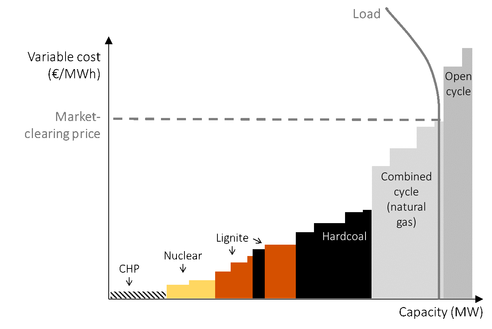
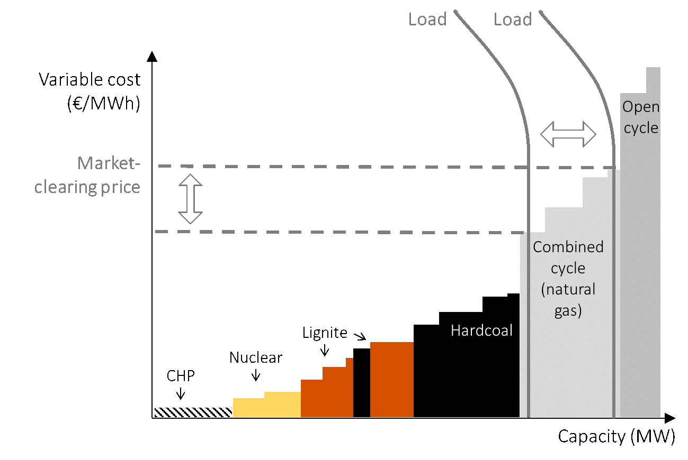
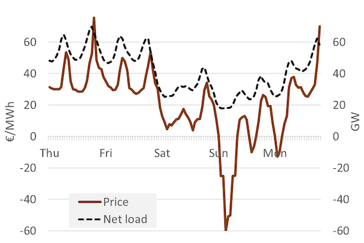
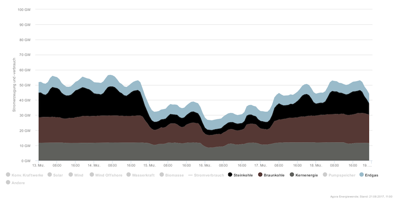
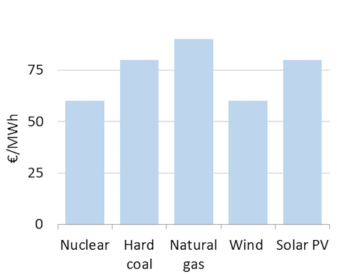

# The price and value of electricity

## Learning objectives

In this chapter, we would like to answer the following questions:
* How are prices determined?
* Why do electricity prices vary so much over short intervals?
* What is the “market value of electricity” and how does it relate to levelized cost of electricity?

### 1. Electricity price variability

**Prices vary.** In countries where wholesale markets for electricity (i.e. markets where generators, retailers and industrial customers trade with each other) exist, a different electricity price is determined for short time steps, such as every hour, every quarter-hour or even every five-minute interval. The price of electricity can vary sharply even between two consecutive five-minute intervals. Over the course of a week, it is not uncommon to observe intervals with high prices, low prices, price of zero or even negative prices (which means you get paid for consuming electricity!). For example, even though the average annual price of electricity in most countries is somewhere between EUR 30 - 80 per MWh, it is not uncommon to observe electricity prices above EUR 10,000 per MWh at some time intervals and prices below EUR -100 per MWh at others.

**Figure 1.** Average hourly wholesale electricity prices in Germany during five days in 2014.

**Key point:** Electricity prices can vary sharply depending on the time of the day/year.

**Source:** OEE based on data from [Open Power System Data](https://data.open-power-system-data.org/time_series).

**Such price variability is unique to electricity.** The sharp price fluctuations on time scales as short as days, hours, and minutes sets electricity apart from other commodities. Other commodity markets – including crude oil, natural gas, minerals, agricultural products, steel etc. – also exhibit price variation, but to a much lesser extent. For example, in 2016 the German day-ahead price of electricity was EUR 29 per MWh on average, with a minimum of EUR -130 per MWh and a maximum of EUR 105 per MWh. In other words, the range of prices observed was a factor eight of the mean price. By contrast natural gas, crude oil and coal - the three most traded energy commodities – do not show any intra-day price variation at all.
 
**Reasons for price variability.** What makes electricity prices fluctuate so much more than prices of other goods? It is the combination of three characteristics of electricity:

* The supply curve of electricity is upward-sloping
*	Demand and/or supply conditions change over time
*	Electricity cannot be stored economically in large volumes

It is easy to see that there is nothing special about the first two characteristics. An upward-sloping supply curve is a feature that electricity shares with most other commodities. The same is true for time-varying demand – just as demand for electricity is higher during the day than at night, demand for coffee is higher in the morning hours than at noon. And yet coffee prices do not vary as much on the exchange as electricity prices do. It is the third characteristic of electricity, i.e. non-storability, which sets it apart from other goods. Coffee beans can be stored over night to satisfy the morning peak demand, but electricity cannot.

**Implications of price variability.** There are at least three important consequences of price variability:
*	Designing electricity markets is more difficult than organizing trade of other goods, because prices change so quickly.
*	The economics of a power plant depends on when it generates electricity. Consider a hypothetical plant that has zero fixed and zero variable cost (and hence a LCOE of zero) but produces electricity only when prices on the wholesale markets are negative. Despite being free, no one would install such a plant.
*	Within an electrical system, it is economically efficient to build power plants based on a range of technologies – some might generate electricity at a low cost all the time (base load plants), while others may be designed to generate electricity only when electricity demand, and thus prices, are high (peak load plants).

*Q: Go to Open Power System Data and retrieve hourly prices from Germany for the latest year. Calculate average, minimum and maximum price. Plot prices for a week of your choice.*

### 2. A short-run model: merit-order dispatch

To explain the electricity price and the dispatch of power plants in a predominantly thermal power based electrical system in the short run, the “merit-order” or “supply stack” model is a helpful tool. Essentially, it is a way of depicting short run supply and demand curves.

**In the short run only variable cost matter.** In the short run, the installed generation capacity in a system cannot be increased or decreased – power plants installed in the system can thus be taken as a given. An important consequence of this assumption is that fixed costs do not play any role in the production decision of power plants. Let’s think about it. Since a given power plant has already been constructed it should be willing to produce electricity even if price in the market is infinitesimally higher than its variable cost of generation. Obviously, it would not make any sense for the plant to generate electricity below its variable cost and lose money on every unit of generation. Therefore, in the short run marginal cost of production of electricity must equal the variable cost of generation.

**A merit-order based model of electricity prices.** The merit-order model uses this idea – power plants in the system are ordered “by merit” i.e. by increasing variable cost to derive the short-run electricity supply curve. In the electricity industry, the short-term supply curve is often called merit-order curve. The demand (load) in the short-run is usually assumed to be perfectly price-inelastic and hence represented by a vertical line. It is cost-minimal to dispatch all plants to the left of the load curve while keep the others out of production. This resembles the outcome of a competitive market: The market-clearing electricity price is the point where the merit-order curve intersects the short-run electricity demand. This is always equal to the variable cost of the marginal (last) plant (*Figure 2*). Why can only this point be the equilibrium price? First consider a plant that is left of the intersection (“infra-marginal”): this plant earns a margin and hence would forgo profit if it did not produce, hence it will produce. Now consider a plant to the right (“extra-marginal”): this plant would make a loss if it produced, hence it will not. The only price that ensures that load is exactly served is the intersection.

**Figure 2:** The merit-order model of price determination in a certain hour.

**Key point:** Prices are determined by the intersection of demand and supply.

**Source:** OEE based on [IEA](https://data.open-power-system-data.org/time_series) data.

**Varying load.** The merit-order model can be used to understand why prices vary. One reason is that electricity demand varies due human activity and needs. If demand drops, the clearing price is lowered, and vice versa (*Figure 3*).
 
**Figure 3**: The merit-order model of price determination with fluctuating load.

**Key point**: Prices vary with change in electricity demand.

**Source**: OEE based on [IEA](https://data.open-power-system-data.org/time_series) data.

**How to account for the renewables?** Wind and solar power have zero variable costs and would always fall at the extreme left of the supply curve. However, incorporating these renewable energy generators into the merit-order model is somewhat awkward. This is because, unlike other technologies the availability wind and solar power varies significantly even in the short run. Given these special characteristics, there are two options of integrating wind and solar power. The first is to group them with the thermal generators. This makes sense because that is what they are: suppliers of electricity. However, because the underlying resource varies, the supply curve would then also shift from hour to hour, which means we would need to draw a different diagram for every hour. The other option is to treat wind and solar generation as “negative load” and replace the load curve with the net (or “residual”) load curve. This allows us to use a supply curve that is stable and a residual demand curve that varies over time.

**Dynamic perspective.** *Figure 2* shows power plant dispatch and the market-clear pricing for one specific hour. **Error! Reference source not found.** shows net demand (consumption net of wind and solar generation) as well as the electricity price for the same five days as **Error! Reference source not found..** It becomes evident how clearly price and residual demand are correlated.
 
**Figure 4:** Electricity demand and wholesale price hour-by-hour during one week.

**Key point:** During times of high net demand, prices tend to be high. As a consequence price fluctuates with demand.

**Source:** OEE based on data from [Open Power System Data](https://data.open-power-system-data.org/time_series)

**Figure 4** shows the generation mix by technology during the same week. During periods with low residual demand, technologies with low variable costs are dispatched and at times of high residual demand, high-cost generators also get dispatched.

**Figure 4:** The electricity generation mix by the hour during five days.

**Key point:** The dispatch of generation technology changes over time.

Source: Agorameter

*Q: Derive the merit-order curve based on the data given below. You can derive two separate supply curves depending on the way you incorporate renewables.*

|  Technology |   Installed capacity (GW)    |   Variable cost (€/MWh)  |
|---|---|---|
| Nuclear  |  15 |  5 |
| Lignite  |  25 |  20 |
| Coal  |  20 |  30 |
| Natural gas  |  20 |  50 |
| Wind power  |  30 |  0 |
| Solar PV  |  30 |  0 |

*Q: Based on the merit-order curve you created, calculate the generation mix and the electricity price during nine hours (you will need to use a spreadsheet program).*

|  h |   Load (GW)    |   Wind gen. (%inst cap)  |   Solar gen. (%inst cap)  |
|---|---|---|
| 1  |  30 |  60% | 0% |
| 2  |  40 |  30% | 0% |
| 3  |  50 |  30% | 20% |
| 4  |  60 |  20% | 40% |
| 5  |  70 |  10% | 60% |
| 6  |  60 |  0% | 40% |
| 7  |  70 |  0% | 20% |
| 8  |  50 |  0% | 0% |
| 9  |  30 |  0% | 0% |

*Q: Check out Agora Energiewende’s Agorameter. Choose one week and plot electricity demand, electricity price and generation by technology. Is the result in line with the merit-order model? Which properties fit well, which do not?*

### 3. A quick detour: models in electricity economics

The earlier section described a short run cost optimization model used to determine electricity prices. It is useful to stand back and review the underlying analytical framework and assumptions that are the foundation of not only this particular model, but also of other models for electricity pricing models described in this and the next chapters.

### 3.1 The analytical framework

**Planner perspective.** This chapter takes the perspective of an omniscient and omnipotent “system planner” or “social planner” that minimizes the costs of supplying electricity to consumers, while taking the level of electricity demand as a given. Historically, this type of a social planner solution was derived by vertically integrated utilities planning their electrical systems (if the regulator set incentives properly).

**Market perspective.** As mentioned earlier, in most OECD countries electricity utilities have been unbundled into generation, transmission, distribution, and (sometimes) retail companies. Thus, as such, there is no designated system planner anymore. But this does not undermine the analysis presented in this chapter. If electricity markets are perfect and complete, the social planner solution will coincide with the equilibrium outcome of profit-maximizing firms interacting in electricity markets. We can thus derive the social planner solution and interpret it as the outcome of decentralized decision-making under perfect competition. This approach has two advantages: it allows us to understand the best-case outcomes that the market can deliver (whether or not we reach there is less important at this point) and it is analytically less burdensome than modeling firms individually.

**Short run vs. long run.** In economics, “short run” and “long run” do not describe actual time horizons (such as “long-term means 10 years and longer”). Rather it depends whether capital stock is treated as exogenous or endogenous in the analysis. A short run analysis takes the capital stock as given while a long run analysis includes investment decisions.

**The short-run optimization problem.** In a short-run analysis of electricity markets the capital stock is considered exogenous i.e. the existing set of power plants is simply there and cannot be changed. The optimization problem in the short term, from a system planning perspective, is then to find the set of production decisions that minimize total costs. In other words, in the short run we concern ourselves with how much electricity should be generated by each power plant in the system. This is the “economic dispatch” of electricity. The prices resulting from a short run analysis can be interpreted as market results if capacity is not scarce. In times of capacity scarcity, applying a short run model would be inappropriate. The merit-order model presented above is an example of a short-run model.

**The long-run optimization problem.** In a long-term or “green field” analysis generation capacity in the system is endogenous. In addition to dispatch, we also have to determine how much generation capacity of a particular technology should be built. Thus the long run analysis involves both the production and investment decisions. Note that a “pure” investment model – without solving the dispatch decision simultaneously – is not possible, because it would ignore value differences that stem from different dispatch. This chapter deals with electricity price formation in the short run; the next chapter *The long term* provides a long run analysis.

### 3.2 Standard assumptions

At various places, we take a number of simplifying assumptions to make an analytical or graphical analysis feasible, referring to them as the “standard assumptions”:
*	No imports and exports (i.e., a power market in isolation)
*	Electricity demand is perfectly price-inelastic and cannot be influenced through other means (like “demand side management”) and always needs to be served by supply
*	No electricity storage and no reservoir hydroelectricity
*	All (cost, quantity and other) parameters are known and all agents have per-fect foresight
*	All firms are price taker, i.e. there is no abuse of market power
*	All power plants are perfectly flexible in the sense that they can change output from one moment to the next ramping and cycling restrictions are ignored); as a consequence, the power market consists of separate consecutive equilibriums
*	All plants are also perfectly flexible in the sense that there is no “must-run generation” caused by combined heat and power or system services provision
*	Prices can be freely determined, with no regulatory explicitly or implicitly caps or floors

In addition to the above, the merit order framework assumes that sufficient capacity is installed to be able to serve the load ("generation adequacy”). These standard assumptions can be relaxed, but then a computer model would be required to derive the optimal solution. In spite of these simplifications, the model yields interesting and relevant insights.

### 4. Another short run model: Unit Commitment

**A series of independent equilibriums.** We have relied on the standard assumptions to justify the merit-order model. These include the crucial assumption that all power plants are perfectly flexible in the sense that they can change output from one moment to the next. In other words, ramping and cycling restrictions are ignored. As a consequence, the power market consists of separate consecutive equilibriums – each hour be analyzed independently from all other hours. This is essentially what the merit-order model does: look at one time step at a time.

**Start-up costs.** In reality, it is costly to stop and start up large power plants. This is mainly for two reasons: first, to start up a plant one needs to heat it up, and this process consumes costly fuel without generating electricity. Second, temperature changes cause stress and fatigue on the equipment, including the boiler, high-pressure tubes, turbines, and exhaust gas cleaning equipment, leading to reduced lifetime and/or increased maintenance cost. Not only is start-up costly, it also takes time. Starting a large-scale thermal coal-fired power plant might take 12 to 72 hours.

**Unit commitment models.** When taking into account the restrictions and costs of starting-up a power plant, one cannot treat individual hours as separate: if a power plant is turned off in one hour, it cannot be turned on in the next hour; and no rational generator would turn on a coal-fired power plant just to produce electricity during one hour. Models that account for start-up costs and constraints are called “unit commitment” models. The name stems from the decision to “commit” a unit (i.e., a generator) to produce. This commitment decision needs to take place several hours ahead of real time. Closer to real time, a dispatch decision follows, determining the production levels of committed units between minimum load (maybe 40% of nameplate capacity) and full load (100% of nameplate capacity). Models of the electricity market that account for start-up costs and lead times are called unit commitment models.
**Prices in unit commitment models.** Unlike the merit-order model, unit commitment models cannot be solved with pen and paper anymore; they require computers to be solved. Another complication is that defining incentive-compatible prices in such models is not straightforward: rather than one market-clearing price for all generators for each hour, such models require an additional price for every generator, in order to compensate for start-up costs. These are sometimes called “uplift payments”. Due to the analytical complexity, we assume in the following that there are no uplift payments.
**Must-run.** In addition to start-up costs, another complication makes real-world power plant dispatch more complex that the simple merit-order model suggests: some power plants produce not only electricity but also heat for industrial processes or space heating via district heating networks. Other power plants have committed to supply system services such as balancing power. Both types of plants cannot easily be turned off during periods of low prices, because the production of heat and system services is linked to electricity generation. They are forced to produce electricity despite negative margins, a phenomenon sometimes called “must-run”. Must-run generation and start-up costs both help explain why there can be negative prices – a phenomenon the merit-order model cannot explain.

### 5. Market value

**Defining market value.** In the markets where electricity is traded, prices are usually quoted for discrete time blocks: 5 minutes, 15 minutes, 30 minutes or 60 minutes. As a consequence, the average revenue of a power plant depends on when it generates electricity. We call the average revenue per MWh in a certain year the “market value” of electricity. Formally, it can be defined as

	market value_i=(∑_(t=1)^T▒〖g_(i,t)  × p_t 〗)/(∑_(t=1)^T▒g_(i,t) ),	( 1 )

where g_(i,t) is the generation of an electricity generation technology i in hour (or any other time block) t, p_t is the wholesale electricity price in that hour and T is the number of hours per year. The market value has at least three different interpretations:
*	It is the average revenue earned by the generators per mega-watt hour of electricity
*	It is the production-weighted (“wind-weighted”) electricity price
*	It is the marginal economic value of electricity produced by generator type 𝑖

**Revenue equivalent of LCOE.** In some way, the market value is the other side of the coin of levelized energy costs. LCOE is the average cost per unit of electricity generated, while market value is the average revenue per unit. If market value exceeds LCOE, an investment is profitable and should take place, and vice versa. Both metrics can be calculated for the lifetime of a power plant but are often expressed in annualized terms for analytical convenience.

**Market value differs.** The market value of power plants differs based on how these plants are designed and operated. Base load plants, which are designed to run around the clock, earn the (relatively low) average electricity price or the “base price”. Usually such plants also have the lowest levelized cost of generation in the system due to their low variable costs and high running hours (remember *The cost of electricity*). On the other hand, peak load plants, which operate only when market demand is relatively high compared to the supply, earn much higher-prices on an average. But because they generate lower amount of electricity – producing only during peak hours as opposed to continuous operation of base load plants – the average cost of generation is also higher. Thus in general, thermal plants like coal and nuclear that produce low-cost cost electricity tend also to generate low-value electricity while plants like natural gas that have higher generation costs also generate more highly valuable electricity. The market value of wind and solar power depends on their market share, as we will discuss in *The economics of renewable energy*. As a consequence of these systematic differences in value, comparing generation costs of different technologies is quite meaningless. A technology that generates electricity at lower cost may not be the most profitable/economic option.

**Figure 5:** Market value of different technologies (illustrative).
**Key point:** The market value of technologies differs.

**Source:** OEE

*Q: Based on the merit-order curve and the hourly prices you have calculated in the above section, determine the market value of each technology.*

*Q: Download hourly prices as well as wind and solar generation from Open Power System Data. Calculate the market value of wind and solar energy for the most recent year.*

*Q: Suppose you work at a utility and lead the project to construct a new gas-fired combined cycle plant. The new CEO decides to rather go for a nuclear plant, because that has lower levelized energy costs (LEC). You meet the CEO in the elevator and have 30 seconds to convince him that he should build “your” gas fired power plant instead. Write an elevator pitch of 100 words max.*

### 6. Different price discovery mechanisms

**System planner?** The way the merit-order (and the unit commitment) model was presented above implicitly suggests that there exists an omniscient and omnipotent “system planner” who knows the variable costs of each power plant and can dispatch each plant (determine how much each power plant must produce at a given point in time) accordingly. In reality, this is not the case. However, the merit-order model remains a useful framework to think about dispatch and price discovery in different market models, including:

*	An integrated utility
*	A central dispatch market
*	A self-dispatch market

**Integrated utility.** In the most straightforward case, the merit-order model can be thought of as describing an integrated electricity company that owns all power plants in a market. Since all the power plants are owned by a single entity, all generation costs are known. It is easy to see that such a company would minimize its total generation cost by deriving a merit-order of supply and equating it to demand in the manner described above.

**Central dispatch.** The merit-order model is also useful in describing price determination in markets with more than a single generation company. In some markets like the United States, a central dispatcher or the “independent system operator” (ISO) that coordinates generation of various plants and determines the dispatch schedule (which power plant is required to produce how much power in a given time slot) and the electricity price. The system operator receives the price and quantity bids from all generators for a particular time slot. Based on these bids the ISO determines the merit-order curve, and depending upon the load, the electricity price. It is easy to see that if the market is competitive i.e. generators are price-takes and accepted bids receive a common clearing price, it is profit-maximizing for all the generators in the market to bid a price equal to their variable costs: a lower bid could lead to losses (if the price discovered in the market is below their variable cost), while a higher bid could lead to foregone profits if the generator is not dispatched. The outcome is thus same that in case all the generation capacity was owned by a single company.

**Self-dispatch.** In a so-called “self-dispatch” system there is no central entity that coordinated generation or creates the dispatch schedule. Rather generators and consumers (big industrial consumers and electricity utilities) either trade bilaterally or in a power exchange until a stable market price emerges. Also in this case, if markets are competitive, a market-clearing price will be determined and all power plants with variable costs below this price will be dispatched while the others will not.
In this chapter, we have studied electricity price determination for an existing fleet of power plants. But which plants should be built in the first place? This is the topic of the *next chapter.*
