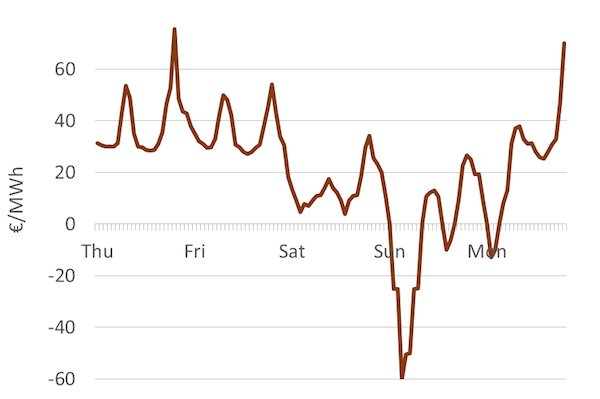
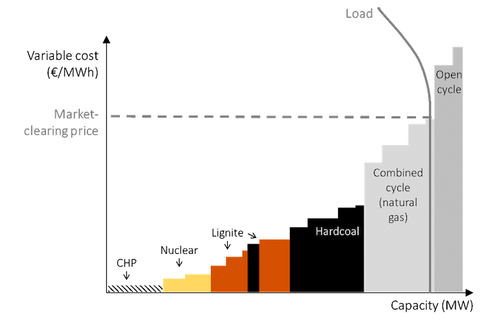
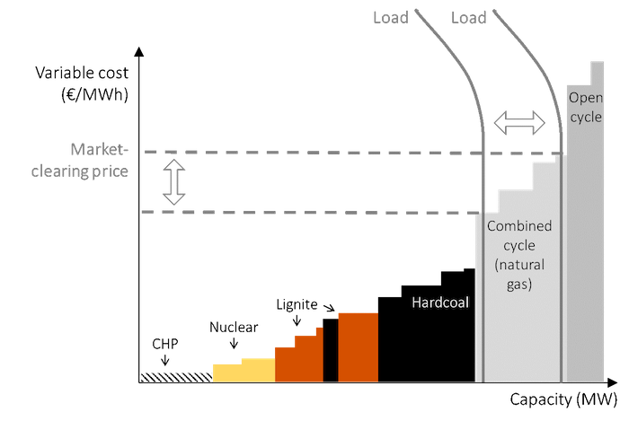

# The price and value of electricity

### Learning objectives

In the previous chapter we discussed the cost of generating renewable energy. We will now turn to the market value of electricity. We will focus on the fact that electricity prices vary hour-by-hour and the implication this has for the economics of electricity generators. By the end of this chapter the reader will be able to:

*	Appreciate that electricity prices may vary significantly over short intervals 
*	Understand how electricity prices are determined in the wholesale markets
*	Get an overview of different models that explain such price setting
*	Understand the “market value of electricity” and see how it relates to levelized cost

## 1. Electricity price fluctuations

Let us start with some basic empirical observations of electricity prices in liberalized wholesale power markets, i.e. markets where generators, retailers and industrial customers trade electricity with each other. These are the prices that determine revenues and profits of power plants.

**Prices fluctuate.** In countries where wholesale markets for electricity exist, a different electricity price is determined for short intervals of time, such as every hour, every quarter-hour or even every five-minutes. The price of electricity can vary sharply even between two consecutive five-minute in-tervals. Over the course of a week, it is not uncommon to observe intervals with high prices, low prices, price of zero or even negative prices (which means you get paid for consuming electricity!). For example, even though the average annual price of electricity in most countries is somewhere between EUR 30 - 80 per MWh, it is not uncommon to observe electricity prices above EUR 1000 per MWh during some time intervals and prices below EUR -100 per MWh during others. This is illustrated in *Figure 1*, which shows the hour-by-hour electricity prices on the so-called day-ahead market in Ger-many over one week.

**Figure 1.** Average hourly wholesale electricity prices in Germany during five days in 2014  
**Key point:** Electricity prices can vary sharply depending on the time of the day/year.

Source: OEE based on data from [Open Power System Data](https://data.open-power-system-data.org/time_series)

**Electricity markets are unique.** The sharp price fluctuations on time scales as short as hours and minutes sets electricity markets apart from other commodities. Other commodity markets – including crude oil, natural gas, minerals, agricultural products, steel etc. – also exhibit price variation, but to a much lesser extent. For example, in 2016 the German day-ahead price of electricity was EUR 29 per MWh on average, with a minimum of EUR -130 per MWh and a maximum of EUR 105 per MWh. In other words, the range of prices observed was a factor eight of the mean price. By contrast natural gas, crude oil and coal – the three most traded energy commodities – do not show much intra-day price variation. Annual movements in prices are also more gradual and variations less dramatic. For example, in 2016 the price of coal increased from around USD 50 per MT to USD 100 per MT and re-mained between USD 75 per MT and USD 100 per MT throughout 2017.

**Reasons for price fluctuations.** What makes power prices fluctuate so much more than prices of other goods? It is the combination of three characteristics of electricity:

*	The supply curve of electricity is upward-sloping
*	Demand and/or supply conditions change over time 
*	Electricity cannot be stored economically in large volumes

It is easy to see that there is nothing special about the first two characteristics. An upward-sloping supply curve is a feature that electricity shares with most other commodities. The same is true for time-varying demand – just as demand for electricity is higher during the day than at night, demand for coffee is higher in the morning hours than at noon. And yet coffee prices on commodity exchanges do not necessarily increase during the morning hours, while electricity prices do peak during the even-ing. It is the third characteristic of electricity, i.e. non-storability, which sets it apart from other goods. Coffee beans can be stored over night to satisfy the morning peak demand, but electricity cannot.

**Predictable changes.** To be more precise, we can differentiate between predictable and non-predictable prices changes. Unexpected shocks in demand and supply can affect prices of any com-modity, i.e. the news of a pipeline failure can lead to rapid swings in the crude oil price. Unlike other commodities, however, electricity prices fluctuate sharply between low and high periods of demand even when the demand and supply changes predictably. 

**Implications of price fluctuations.** There are at least three important consequences of sharply fluctuating electricity prices:

*	Designing electricity markets is more difficult than organizing trade of other goods, because prices change so quickly.
*	The economics of a power plant depends on when it generates electricity. Consider a hypo-thetical plant that has zero fixed and zero variable cost (and hence a LCOE of zero) but produces electricity only when prices in the wholesale markets are negative. Despite being free, no one would install such a plant.
*	Within an electrical system, it is economically efficient to build power plants based on a range of technologies – some might generate electricity at a low cost all the time (base load plants), while others may be designed to generate electricity only when electricity demand, and thus prices, are high (peak load plants).

## 2. A short-run model: merit-order dispatch

**Merit order dispatch.** It is important to recognize that in the short run, the installed generation capacity in a system cannot be increased or decreased. An important consequence of this assumption is that fixed costs do not play any role in the production decision of power plants. Let’s think about this. Since a given power plant has already been constructed it should be willing to produce electricity even if the market price is infinitesimally higher than its variable cost of generation. On the other hand it would not make any sense for the plant to generate electricity if the market price is below its varia-ble cost, as it would lose money on every unit of generation. Thus in the short run marginal cost of production of electricity must equal the variable cost of generation. We can use this idea to derive the supply curve of electricity. This is done by simply ordering power plants in the system “by merit” i.e. by increasing variable cost. The resulting short-term supply curve of electricity is called the merit-order dispatch (curve) in industry parlance. 
A merit-order based model of electricity prices. The “merit-order” or “supply stack” model is a helpful tool for explaining the electricity price determination in a predominantly thermal power (coal, gas, nuclear) based electrical system in the short run. 

A fundamental building block of the model is the merit order curve, which serves as the short run supply curve of electricity. The demand for electricity, in the short-run, is usually assumed to be per-fectly price-inelastic and is therefore represented by a vertical line. The market-clearing equilibrium price is the point where the merit-order curve intersects the short-run electricity demand (*Figure 2*). Why can only this point be the market-clearing price? Let’s consider a power plant on the merit order curve that is to the left of the intersection point (“infra-marginal power plants”): this plant earns a positive amount, equal to the difference between the market clearing price and its own variable cost, and will thus forgo profit by not generating electricity. Now consider a plant to the right of the market-clearing price (“extra-marginal plants”): this plant would incur a loss on every unit of generation and thus would not rationally generate electricity. The last power plant to generate electricity (“marginal plant”) is the one whose variable cost is equal to the market-clearing price, and it will generate with-out incurring any profit or loss. 

In summary, in the short run it is optimal to “dispatch” all plants to the left of the marginal plant on the merit order dispatch and keep those to the right out of production, and the only price that en-sures that load is exactly served is the variable cost of the marginal power plant. 

**Figure 2:** The merit-order model of price determination in a certain hour  
**Key point:** Prices are determined by the intersection of demand and supply.

Source: OEE based on [IEA](https://data.open-power-system-data.org/time_series) data

**Fluctuating load.** The merit-order model can be used to understand why prices vary. One reason is that electricity demand varies due human activity and needs. If demand drops, the clearing price is lowered, and vice versa (*Figure 3*).

**Figure 3**: The merit-order model of price determination with fluctuating load  
**Key point**: Prices vary with change in electricity demand.

Source: OEE based on [IEA](https://data.open-power-system-data.org/time_series) data

**How to account for the renewables?** Wind and solar power have zero variable costs and would always fall at the extreme left of the supply curve. However, incorporating these renewable energy generators into the merit-order model is somewhat awkward. This is because, unlike other technologies the availability wind and solar power varies significantly even in the short run. Given these special characteristics, there are two options of integrating wind and solar power. The first is to group them with the thermal generators. This makes sense because that is what they are: suppliers of electricity. However, because the underlying resource varies, the supply curve would then also shift from hour to hour, which means we would need to draw a different diagram for every hour. The other option is to treat wind and solar generation as “negative load” and replace the load curve with the net (or “residual”) load curve. This allows us to use a supply curve that is stable and a residual demand curve that varies over time.

**Dynamic perspective.** *Figure 2* shows power plant dispatch and the market-clear pricing for one specific hour. *Figure 4* shows net demand (consumption net of wind and solar generation) as well as the electricity price for the same five days. It becomes evident how clearly price and residual demand are correlated.

**Figure 4:** Electricity demand and wholesale price hour-by-hour during one week  
**Key point:** During times of high net demand, prices tend to be high. As a consequence price fluctuates with demand.

Source: OEE based on data from [Open Power System Data](https://data.open-power-system-data.org/time_series)

*Figure 5* shows the generation mix by technology during the same week. During periods with low residual demand, technologies with low variable costs are dispatched and at times of high residual demand, high-cost generators also get dispatched.

**Figure 5:** The electricity generation mix by the hour during five days  
**Key point:** The dispatch of generation technology changes over time.

Source: Agorameter

## 3. A quick detour: models in electricity economics

The earlier section described a short run cost optimization model used to determine electricity prices. It is useful to stand back and review the underlying analytical framework and assumptions that are the foundation of not only this particular model, but also of other models for electricity pricing models described in this and the next chapters.

### 3.1 The analytical framework

**Planners’ perspective.** This chapter takes the perspective of an omniscient and omnipotent “sys-tem planner” or “social planner” that minimizes the costs of supplying electricity to consumers, while taking the level of electricity demand as a given. Historically, this type of a social planner solution was derived by vertically integrated utilities planning their electrical systems (if the regulator set incentives properly). 

**Market perspective.** In most OECD countries vertically electricity utilities have been unbundled into generation, transmission, distribution, and (sometimes) retail companies. Thus, as such, there is no designated system planner anymore. But this does not undermine the analysis presented in this chapter. If electricity markets are perfect and complete, the social planner solution will be the same as the equilibrium outcome of profit-maximizing firms interacting in electricity markets. We can thus derive the social planner solution and interpret it as the outcome of decentralized decision-making under perfect competition. This approach has two advantages: it allows us to understand the best-case outcomes that the market can deliver and it is analytically less burdensome than modeling firms individually. 

**Short run vs. long run.** In this book, and in economics in general, “short run” and “long run” do not describe actual time horizons (such as “long run means 10 years and longer”). Rather it depends on whether capital stock is treated as exogenous or endogenous in the analysis. A short run analysis takes the capital stock as given while a long run analysis includes investment decisions. 

**The short run optimization problem.** In a short run analysis of electricity markets the capital stock is considered exogenous i.e. the existing set of power plants is simply there and cannot be changed. The merit-order model presented in this chapter is an example of a short run model. The optimization problem in the short run, from a system planning perspective, is then to find the set of production decisions that minimize total costs. In other words, in the short run we concern ourselves with how much electricity should be generated by each power plant in the system. This is called the “economic dispatch” of electricity. The prices resulting from a short run analysis can be interpreted as market results if capacity is not scarce. In times of capacity scarcity, applying a short run model would be inappropriate. 

**The long run optimization problem.** In a long run or “green field” analysis generation capacity in the system is endogenous. In addition to dispatch, we also have to determine how much generation capacity of a particular technology should be built. Thus the long run analysis involves both the production and investment decisions. Note that a “pure” investment model – without solving the dispatch decision simultaneously – is not possible, because it would ignore value differences that stem from different dispatch. Such long run analysis is presented in the next chapter, _**[Optimal capacity mix and scarcity pricing](05.html#optimal-capacity-mix-and-scarcity-pricing)**_.

### 3.2 Standard assumptions

At various places in this book, we make the following simplifying assumptions for ease of analytical or graphical analysis. We refer to them as “standard assumptions”. 

*	No imports and exports (a power market in isolation)
*	Electricity demand is perfectly price-inelastic and cannot be influenced through other means (like “demand side management”) and always needs to be served by supply
*	No electricity storage and no reservoir based hydroelectricity 
*	All (cost, quantity and other) parameters are known and all agents have perfect foresight
*	All firms are price takers, i.e., there is no abuse of market power
*	All power plants are perfectly flexible in the sense that they can change output from one mo-ment to the next; ramping and cycling restrictions are ignored
*	All plants are also perfectly flexible in the sense that there is no “must-run generation” from combined heat and power stations or system services provision
*	Prices can be freely determined, with no explicit or implicit regulatory caps or floors 
*	In addition to the above, the merit order framework assumes that sufficient capacity is in-stalled to serve the load ("generation adequacy”). 

These standard assumptions can be relaxed, but then a computer model would be required to derive the optimal solution. The assumptions do not undermine the results. In fact, in spite of these simplifications, the simplified models presented in this book yield relevant and practical insights.

## 4. Another short run model: Unit Commitment

**A series of independent equilibriums.** We have relied on the standard assumptions to justify the merit-order model. These include the crucial assumption that all power plants are perfectly flexi-ble in the sense that they can change output from one moment to the next. In other words, ramping and cycling restrictions are ignored. As a consequence, in the merit-order model, each hour is ana-lyzed independently from all other hours and the power market is modeled as a series of discrete consecutive equilibriums. 

**Start-up costs.** In reality, it is costly to stop and start up large power plants. This is mainly for two reasons: first, to start up a plant one needs to heat it up and this process consumes costly fuel without generating electricity. Second, temperature changes cause stress and fatigue on the equipment, in-cluding the boiler, high-pressure tubes, turbines, and exhaust gas cleaning equipment, leading to reduced lifetime and/or increased maintenance cost. Not only is start-up costly, it also takes time. Starting a large-scale thermal coal-fired power plant might take 12 to 72 hours.

**Unit commitment models.** When taking into account the restrictions and costs of starting-up a power plant, one cannot treat individual hours as separate: if a power plant is turned off in one hour, it cannot be turned on in the next hour; and no rational generator would turn on a coal-fired power plant just to produce electricity during one hour. Models that account for start-up costs and con-straints are called “unit commitment” models. The name stems from the decision to “commit” a unit (i.e., a generator) to produce. This commitment decision needs to take place several hours ahead of real time. Closer to real time, a dispatch decision follows, determining the production levels of com-mitted units between minimum load (maybe 40% of nameplate capacity) and full load (100% of nameplate capacity). Models of the electricity market that account for start-up costs and lead times are called unit commitment models.

**Prices in unit commitment models.** Unlike the merit-order model, unit commitment models cannot be solved with pen and paper anymore and are usually solved using advanced computer simu-lations. Another complication is that defining incentive-compatible prices in such models is not straightforward: rather than one market-clearing price for all generators for each hour, such models require an additional price for every generator, in order to compensate for start-up costs. These are sometimes called “uplift payments”. 

**Must-run.** In addition to start-up costs, another complication makes real-world power plant dispatch more complex that the simple merit-order model suggests: some power plants produce not only elec-tricity but also heat for industrial processes or space heating via district heating networks. Other power plants have committed to supply system services such as balancing power. Both types of plants cannot easily be turned off during periods of low prices, because the production of heat and system services is linked to electricity generation. They are forced to produce electricity despite negative margins, a phenomenon sometimes called “must-run”. Must-run generation and start-up costs both help explain why electricity prices can be negative – a phenomenon the merit-order model cannot explain.

## 5. Market value

**Defining market value.** In the markets where electricity is traded, prices are usually quoted for discrete time blocks: 5 minutes, 15 minutes, 30 minutes or 60 minutes. As a consequence, the average revenue of a power plant depends on when it generates electricity. We call the average revenue per MWh in a certain year the “market value” of electricity. Formally, it can be defined as

\begin{equation}
\label{eq:1}
market value_i =  \frac{\sum_{t=1}^{T} g_{i,t} \cdot p_t}{sum_{t=1}^{T} g_{i,t}} 
\end{equation}

where *gi,t* is the generation of an electricity generation technology *i* in hour (or any other time block) *t*, *pt* is the wholesale electricity price in that hour and *T* is the number of hours per year. The market value has at least three different interpretations:

*	It is the average revenue earned by the generators per mega-watt hour of electricity
*	It is the production-weighted (“wind-weighted”) electricity price
*	It is the marginal economic value of electricity produced by generator type 𝑖

**Revenue equivalent of LCOE. **The market value is the other side of the coin of levelized energy costs. LCOE is the average cost per unit of electricity generated, while market value is the average revenue per unit. If market value exceeds LCOE, an investment is profitable and should take place, and vice versa. Both metrics can be calculated for the lifetime of a power plant but are often expressed in annualized terms for analytical convenience.

**Market value differs.** The market value of power plants differs based on how these plants are de-signed and operated. Base load plants, which are designed to run around the clock, earn the (relatively low) average electricity price or the “base price”. Usually such plants also have the lowest levelized cost of generation in the system due to their low variable costs and high running hours (remember _**[The cost of electricity](03.html#the-cost-of-electricity))**_. On the other hand, peak load plants, which operate only when market demand is relatively high compared to the supply, earn much higher-prices on an average. But because they generate lower amount of electricity – producing only during peak hours as opposed to continuous operation of base load plants – the average cost of generation is also higher. Thus in general, thermal plants like coal and nuclear that produce low-cost cost electricity also tend to generate low-value elec-tricity while plants like natural gas that have higher generation costs also generate more highly valuable electricity. The market value of wind and solar power depends on their market share, as we will discuss in _**[The economics of renewable energy](06.html#the-economics-of-renewable-energy)**_ As a consequence of these systematic differences, comparing generation costs of different technologies, without referring to value is can be misleading. A technology that generates electricity at lower cost may not be the most profitable/economic option.

**Figure 6:** Market value of different technologies (illustrative)  
**Key point:** The market value of technologies differs.

Source: OEE

## 6. Different price discovery mechanisms

**System planner.** The way the merit-order (and the unit commitment) model was presented above implicitly suggests that there exists an omniscient and omnipotent “system planner” who knows the variable costs of each power plant and can dispatch each plant (determine how much each power plant must produce at a given point in time) accordingly. In reality, this is not the case. However, the merit-order model remains a useful framework to think about dispatch and price discovery in different market models, including:

*	An integrated utility
*	A central dispatch market
*	A self-dispatch market

**Integrated utility.** In the most straightforward case, the merit-order model can be thought of as describing an integrated electricity company that owns all power plants in a market. Since all the pow-er plants are owned by a single entity, all generation costs are known. It is easy to see that such a company would minimize its total generation cost by deriving a merit-order of supply and equating it to demand in the manner described above. 

**Central dispatch.** The merit-order model is also useful in describing price determination in markets with more than a single generation company. In some markets like the United States, a central dis-patcher or the “independent system operator” (ISO) that coordinates generation of various plants and determines the dispatch schedule (which power plant is required to produce how much power in a given time slot) and the electricity price. The system operator receives the price and quantity bids from all generators for a particular time slot. Based on these bids the ISO determines the merit-order curve, and depending upon the load, the electricity price. It is easy to see that if the market is compet-itive i.e. generators are price-takes and accepted bids receive a common clearing price, it is profit-maximizing for all the generators in the market to bid a price equal to their variable costs: a lower bid could lead to losses (if the price discovered in the market is below their variable cost), while a higher bid could lead to foregone profits if the generator is not dispatched. The outcome is thus same that in case all the generation capacity was owned by a single company. 

**Self-dispatch.** In a so-called “self-dispatch” system there is no central entity that coordinated gen-eration or creates the dispatch schedule. Rather generators and consumers (big industrial consumers and electricity utilities) either trade bilaterally or in a power exchange until a stable market price emerges. In this case, if markets are competitive, a market-clearing price will be determined and all power plants with variable costs below this price will be dispatched while the others will not.