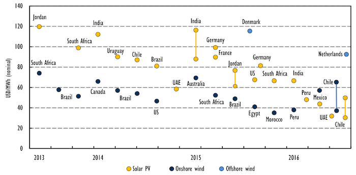
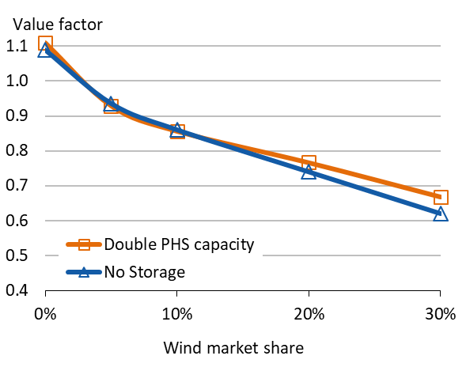
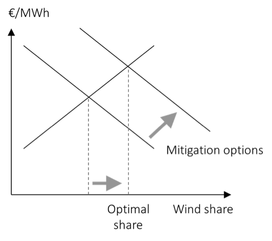

# The economics of renewable energy

### Learning objectives

In this chapter, we will learn more about the economics of renewable energy, with a focus on the modern and “variable” sources wind and solar energy. We look at both their economic cost and value. At the end of the chapter, the reader will be able to:

*	Understand the extent of the cost decline of wind and solar energy
*	Decompose the cost decline into individual drivers
*	Determine the economic value of wind and solar energy
*	Understand that this value drops with penetration
*	Discuss various measures to mitigate this value drop

## 1. The boom in wind and solar power

**Capacity additions.** Until recently, the only renewable energy source that held a significant market share in the global electricity supply was hydroelectricity. Wind power started gaining traction in the first decade of the 21st century and has witnessed rapid growth since 2010, with about 50 GW additions to generation capacity annually (*Figure 1*). Solar power is the newest entrant on the scene. Meaningful additions to global solar capacity started only after 2010, with about 40 GW annual capac-ity additions since then (*Figure 2*). 

| **Figure 1.** Cumulative global wind power capacity  | **Figure 2.** Cumulative global solar power capacity  |
| :------------- | :------------- |
| **Key point:** During the past 15 years more than 400 GW of wind power capacity was added. | **Key point:** Before 2010 total solar capacity was very small, but has increased rapidly since then.  |
|        |       |
|Source: OEE, based on data from REN21 (2017) and      IEA (2017)       | Source: OEE, based on data from REN21 (2017) and IEA (2017)      |

**Renewables over take fossil fuels. The year 2015 marked a turning point.** For the first time ad-ditions to renewable energy based generation capacity were greater than additions to conventional fossil fuel based capacity, and the trend has continued since. 

**Figure 3.** Share of renewables in annual additions to global capacity  
**Key point:** In 2015, more than half of additions generation capacity was based on renewable energy.

Source: IEA

**A global phenomenon.** In the early 2000s renewable energy investments were concentrated in a handful of European countries, but this is no longer the case. Today, the five BRICS countries operate more renewable capacity than the 28 EU member countries. China alone has more than three times the installed wind power capacity as Germany (*Figure 4*).

**Figure 4.** Renewable power capacity additions by region  
**Key point:** Renewable power investments are globally well dispersed.

Source: REN21 (2017) Global renewables status report

**Generation share.** In spite of the impressive increase in generation capacity, the share of wind and solar power in total electricity generation (in MWh terms) is a mere 5 percent. This is because wind and solar power plants have a capacity factor of 10-40 percent, compared to a factor of 60-95 percent for most thermal power plants. 

 | Source |	Global generation share |
 |---|---|
 |Coal | 41% |
 | Natural gas | 22% | 
 | Hydro | 16% | 
 | Nuclear | 11% | 
 | Biomass, wind, solar | 6% | 
 | Oil | 4% |
 
 
Source: IEA Key World Energy Statistics 2016

**High penetration of renewables.** But in individual regions these renewable energy sources have gained a much higher share. In 9 out of 33 IEA member countries, wind and solar power supplies more than 10 percent of electricity demand, with the Demark being the clear leader at 40 percent. On the Iberian Peninsula, wind and solar together provide more than a quarter of the total electricity. In mid-western United States, wind power has a share of more than 25%.  Some states in India and a number of Chinese provinces also have high share of renewables in total electricity supply. These numbers prove that despite challenges in technical system operation it is possible to run power systems reliable at very high penetration rates of wind and solar energy, something that was regularly challenges by certain observers until recently. 

**Figure 5.** Share of wind and solar in total electricity consumption  
**Key point:** In at least 10 European countries, wind and solar now supplies more than 10 percent of electricity demand. On the Iberian Peninsula, the share is more than 25 percent.

Source: OEE, based on data from IEA Electricity Statistics

**More statistics.** Several publications provide regular updates about the status of renewable energy in detail. Some major annual publications that provide this information are:

* IEA: Renewable Energy Medium-Term Market Report
* IRENA: 	Renewable Energy Statistics
* REN21: Renewables Global Status Report

## 2. Declining costs of wind and solar power
### 2.1 Estimating cost of wind and solar

**Estimating costs.** Most estimates of cost of wind and solar power use one of these two techniques: (1) estimate generation cost based on estimates of equipment and financing cost; (2) consider that true costs are reflected in the price quoted by power plant developers in auctions that buyers hold for procuring renewable energy. Neither approach is without problems. Using the first approach requires us to know the actual project costs – information that only investors possess. The second approach, of taking tender prices as cost of production, is also problematic because tender bids are not cost-reflective if they include strategic considerations or hidden subsidies. In general it is important to be mindful of the source of the data about costs while deriving any conclusions. In particular estimates from a single auction or project cannot, and should not, be generalized to reflect industry wide costs. Nevertheless, by considering information from various sources a trend can be constructed.

**Declining costs.** Measured by any metric, the cost of wind and solar power has decreased sharply during the past decade. *Figure 6* displays the generation costs of onshore wind energy and those of solar PV, as derived from IRENA’s project-specific cost database. *Figure 7* summarizes major recent auctions for renewable energy. Together, these figures present a compelling and robust fact: the cost of generating electricity from wind and solar energy has more halved in recent years. On an average, cost of wind power is now around USD 70 per MWh and solar power around USD 130 per MWh. Un-der favorable conditions, costs can be lower: in some cases investors have committed to provide wind and solar energy for less than USD 40 per MWh. 

**Figure 6.** Levelized cost of electricity of onshore wind  
**Key point:** The average levelized cost of wind power has decreased from $200/MWh to $70/MWh over the last 20 years.

Source: IRENA Renewable Cost Database and analysis

**Figure 7.** Levelized cost of electricity of solar PV  
**Key point:** The average levelized cost of solar power has reduced from  $300/MWh to $130/MWh over the last 5 years.

Source: IRENA Renewable Cost Database and analysis

**Auction results.** *Figure 8* displays the outcome of selected tenders for renewable energy. In coun-tries with good wind and solar resources, such as some South American and Middle East countries, auctions have resulted the prices below USD 50 per MWh for both wind and solar energy. In countries with much less attractive resources, but low cost of capital, including several European countries, auc-tions have resulted in similarly low prices.

**Figure 8.** Tender results for renewable power  
**Key point:** Investors now offer to supply renewable power for $30-70/MWh in many parts of the world.

Source: IEA (2016): Medium term RES market report

### 2.2. Reasons for decline in cost of wind and solar power  

In _**[The cost of electricity](03.html#the-cost-of-electricity)**_, we defined levelized costs of electricity (LCOE) as the aggregated discounted lifetime cost of generating electricity per unit of output. It is calculated using the following formula:

\begin{equation}
\label{eq:1}
LCOE=  \frac{C_{fix} + \sum_{y=1}^{Y}(1+r)^{-y} \cdot C_y} {\sum_{y=1}^{Y}(1+r)^{-y} \cdot G_y}
\end{equation}

where *LCOE* is the levelized cost in EUR per MWh, *Cfix* is the investment cost incurred for setting up the project, *Cy* are other costs incurred in year *y*, *r* is the discount rate, *Y* is the technical lifetime in years, and *Gy* is electricity generation in MWh. 

**Levelized costs for RE.** To clearly see the determinants of LCOE, we can rewrite equation (1) by explicitly acknowledging that for wind and solar energy, the only annual costs are O&M expenses, and that yearly generation can be written as the capacity factor times 8760 times installed capacity:

\begin{equation}
\label{eq:2}
LCOE=  \frac{C_{fix} + \sum_{y=1}^{Y}(1+r)^{-y} \cdot C_{y(OM)} } {\sum_{y=1}^{Y}(1+r)^{-y} \cdot cf \cdot 8760}
\end{equation}

We can now see that the levelized cost of electricity is a function of following:  

*Cfix*: Investment costs per kW of installed capacity  
*Cy(OM)*: Annual operation and maintenance (O&M) expenses in year y  
*r*:  Weighted average cost of capital (WACC)  
*cf*: Capacity factor  

The dramatic reduction in cost of wind and solar power over the last decade has been possible because all the important determinants of generation cost changed favorably.  

**Investment costs.** The cost of buying and installing wind turbines and solar photovoltaic (PV) modules has declined sharply in recent years. For example, onshore wind turbine prices have dropped by 30-50% since 2008, according to data gathered by the U.S. Department of Energy (DOE) and the consulting firm Bloomberg New Energy Finance (both time series are shown in *Figure 9*). It is interesting to note, however, that turbine prices had been increasing during the decade before, driven by high demand for turbines and high prices of raw materials such as copper and steel.

The price decline for solar PV has been more dramatic. Led by a reduction in price of solar modules by 80%, the price of a small-scale rooftop solar system in Germany has declined by 75% since 2006, according to data from Germany’s Bundesverband Solarwirtschaft. Solar modules can be easily shipped around the world hence their prices (before taxes and tariffs) are quite uniform across the world. Cost of installing the modules varies with the size of installation and the market conditions. The reduction in price of wind turbines and solar modules has been driven by intense competition among suppliers, economies of scale in production and technological advances that have reduced manufacturing costs.

| **Figure 9.** Price of onshore wind turbines  | **Figure 10.** Price of solar modules  |
| :------------- | :------------- |
| **Key point:** Cost of wind turbines has reduced since 2010.  | **Key point:** Solar module prices have declined by more than 80%.   |
|   |       |
|Source: DOE (2016): Wind power market report     | 	Source: Fraunhofer ISE 2017 - Photovoltaics Report    |

**Operation and maintenance (O&M) expenses.** Along with the reduction in cost of equipment maintenance costs for wind and solar power plants have declined substantially over the last decade. The reduction is especially noteworthy in case of wind power. Innovations such as predictive mainte-nance for turbines has helped reduce O&M costs for onshore wind from around USD 30 per MWh on an average to below USD 10 per MWh over the past decade, according to the United States Depart-ment of Energy (DOE), see *Figure 10*. Similarly, O&M costs for solar energy declined from USD 19 per MWh to USD 7 per MWh during the four years to 2015, according to LBNL (*Figure 12*).

**Figure 11.** O&M costs for U.S. onshore wind  
**Key point:** Reliable technology and automation has dramatically reduced the cost operating and maintaining wind turbines.

Source: DOE (2016): Wind power market report

**Figure 12.** O&M cost for U.S. utility scale solar PV  
**Key point:** O&M cost declined by half from 2011 to 2015

Source: LBNL (2015): Utility scale solar

**Cost of capital.** As we discussed in the chapter on Cost of Electricity, electricity generation in gen-eral, and renewable energy in particular, is highly capital-intensive. Over the last decade reduction in the cost of debt and equity has contributed to reducing the weighted average cost of capital (WACC) of renewable energy projects. On the debt side, the average benchmark real interest rates in G7 coun-tries declined from around 3.5% in 2000 to -0.5% in 2016 (*Figure 13*). While the interest cost faced by RE projects is higher, it has followed a similar trend. Similarly, with respect to equity, the return that investors expect on investment in renewable energy projects has also dropped. The decline in cost of equity reflects not only the overall weak economic environment (which reduces the opportunity cost of investment), but also reduction in the risk profile of the renewable investments. Policy makers across countries have strived to reduce market and regulatory risks faced by the sector. Investors now charge a lower risk premium for investing in renewable electricity, bringing down the expected rate of return on equity.

**Figure 13.** Average ten-year inflation indexed bond yields, G7 countries excluding Italy  
**Key point:** RE has benefitted from low borrowing costs over the last 10 years

Source: The Economist

**Capacity factor.** Improvement in generation technology has increased the capacity factors achieved by renewable power plants. The increase has been particularly large in case of wind power: while ca-pacity factor of around 20 percent was common in the 1990s, average capacity factors for new onshore wind power plants is now as high as 30 percent. In other words, each kW of installed wind power capacity now generates 50% more energy than during the early years of that technology. In-crease in generation capacity per kW, along with reduction in total investment costs per kW, implies that each unit of electricity can now be produced more cheaply.  

| **Figure 14:** Global average capacity factor for onshore wind additions |  **Figure 15:** Global average capacity factors for utility-scale PV systems |
| :------------- | :------------- |
| **Key point:** On global average, wind power has now capacity factors of close to 30%, up from around 20% in the early years.       | **Key point:** Capacity factors have improved with better tracking devices and shift to higher irradiation locations.      |
|       |      |
|Source: IRENA (2016): The power to change: Cost reduction potential      | 		Source: IRENA (2016): The power to change: Cost reduction potential |

**Quantifying the four factors.** It is easily understood that cheaper turbines, reduced O&M expenses, lower cost of capital and increased yield all help to bring down generation costs. But how much did each of these factors contribute?

| Onshore wind    | 2008     |  2016  |
| :------------- | :------------- |:------------- |
| Investment cost  | 1600 €/kW  |	1100 €/kW |
| O&M cost |	15 €/MWh	| 8 €/MWh |
|Discount rate |	8.3%	| 3.9% |
|Capacity factor |	23%	| 28% |

Source: OEE, based on sources of figures referenced above

The table above provides rough estimates for global average LCOE of onshore wind and solar PV in 2008 and in 2017. The figure also shows the contribution of the four factors to this decline. Levelized cost of wind energy declined by more than 40%, and the cost of solar PV by more than 80%. An im-portant reason for this was the decline in equipment cost. While it clearly the most important reason for the solar cost drop, the decline in cost of capital is of similar importance for wind energy. Increased capacity factors also contributed significantly, particularly in the case of wind.

**Figure 16.** Estimates of LCOE for onshore wind and solar PV in 2008 and in 2017, and contribution of individual cost drivers  
**Key point:** Cheaper equipment has been most important in reducing costs but other factors – in particular reduced cost of capital – have also been important.

Source: IRENA (2015)

**More statistics.** Regular update on costs of renewable generation technologies are provided in the following publications:

*	IEA: Renwables 2017 (formerly Renewable Energy Medium-Term Market Report), paywalled
*	IRENA: 	Costing reports
*	LBNL: Tracking the Sun (small-scale solar in the U.S.)
*	LBNL: Utility-Scale Solar
*	NREL: PV System Cost Benchmarks
*	Fraunhofer ISE: Photovoltaics report

### 2.3 Learning curves

Macroeconomic reasons and de-risking policies are important drivers behind the reduced cost of capi-tal. The dominating underlying reason for the other three factors – cheaper equipment, reduced O&M cost and increased capacity factors – is better and cheaper technology. 

**Learning curves.** Dropping equipment prices are often graphically depicted as a “learning curve” or “experience curve”. In industry circles it is common to talk about the “learning rate”: this is the rate at which the cost of production declines each time the cumulative global production of a technology doubles. *Figure 17* and *Figure 18* depict estimates of learning curves for onshore wind and solar PV. According to these estimates, doubling cumulative wind capacity reduces manufacturing costs by 12%; doubling crystalline solar PV capacity brings costs down by 29%.

**Figure 17.** Learning curve for onshore wind  
**Key point:** Increase in production capacity reduces cost of manufacturing

Source: IRENA (2015)

**Figure 18.** Learning curve for solar PV  
**Key point:** Increase in production capacity reduces cost of manufacturing

Source: Fraunhofer ISE 2017 

**The reasons behind better technology.** It should be noted that the concept of a learning curve is purely empirical and descriptive. It does not explain how and why learning is happening, nor does it give a reason why it should happen at a constant rate for each doubling of cumulative production. There are two principle reasons why wind turbines and solar modules are today cheaper and more reliable than a decade ago: economies of scale and technological learning.

## 3. Value of wind and solar energy

The economist of anything has two sides: cost and value. To see if and to what extent renewable en-ergy is economic (both from an investor and from society’s point of view), one needs to study its cost. But one also needs to study its value, which we will do now.

### 3.1.	Empirical data

**Empirics.** Let us start with a look at empirical data. The table below contains electricity price data for Germa-ny for the years 2001 to 2016. The first column shows the average day-ahead electricity price, the so-called “base price”. The base price equals the average income of a “perfect” base load plant that op-erates all year round. Along with the base price of electricity, the table also contains the market value of wind and solar power as defined in _**[The price and value of electricity](04.html#the-price-and-value-of-electricity)**_. The second and fourth columns show market value (the average income in EUR per MWh) of onshore wind and solar respectively. 

| Year | Base price of electricity (1) | Market value of Wind (€/MWh) (2)	| Value factor of Wind (3) |  Market value of Solar (€/MWh) (4)	| Value factor of Solar (5) | 
| :------------- | :------------- |:------------- | :------------- | :------------- |:------------- |
| 2001  |	23	| 27	| 1.01	| 23	| 1.19 | 
| 2002	| 23	| 29	| 0.98	| 22	| 1.30 |
| 2003	| 29	| 38	| 0.95	| 28	| 1.30 |
| 2004	| 29	| 34	| 0.99	| 28	| 1.19 |
| 2005	| 46	| 53	| 0.96	| 44	| 1.15 |
| 2006	| 51	| 65	| 0.92	| 47	| 1.27 |
| 2007	| 38	| 43	| 0.92	| 35	| 1.13 |
| 2008	| 66	| 81	| 0.94	| 62	| 1.23 |
| 2009	| 39	| 43	| 0.94	| 37	| 1.11 |
| 2010	| 44	| 49	| 0.95	| 42	| 1.09 |
| 2011	| 51	| 56	| 0.92	| 47	| 1.10 |
| 2012	| 43	| 44	| 0.88	| 37	| 1.04 |
| 2013	| 38	| 37	| 0.85	| 32	| 0.98 |
| 2014	| 33	| 32	| 0.86	| 28	| 0.98 |
| 2015	| 32	| 31	| 0.85	| 27	| 0.98 |
| 2016	| 29	| 27	| 0.85	| 25	| 0.93 |

Source: OEE based on load data

**Value factor.** The above table (third and fifth columns) also shows the “value factor” for each tech-nology, which is the ratio of market value of each technology to the base price of electricity.

\begin{equation}
\label{eq:3}
LCOE=  \frac{\sum_{t=1}^{T} G_t \cdot P_t} {\sum_{t=1}^{T} G_t} / \frac{\sum_{t=1}^{T} P_t} {T}
\end{equation}

Where *Gt* is the electricity generation (in MWh) of wind/ solar plants and *Pt* the average market price (in EUR/MWh) in time period t.

**From boom to bust.** From the data in the table, we can see that electricity prices change over the years. During the 2000s prices were on the rise, a consequence of the commodity price boom and strong demand. After 2008 electricity prices followed a downward trend until 2016. This is a long and deep boom-bust cycle that caused a profound crisis of European electricity utilities, a topic to which we return in the chapter on *Reasons for the price drop*.

**Diminishing returns.** More importantly, however, it can be observed that the relative price of wind energy – the wind value factor – declined continuously during the entire cycle. Plotted against the share of wind and solar energy in electricity consumption, this pattern becomes more obvious (*Figure 19*). With increasing penetration the relative value of wind and solar energy has declined. For econo-mists this pattern should not come as a surprise: if the supply of commodity increases, its relative price goes down. The reasons why this pattern was overlooked for many years is the complexity of electricity markets, where prices changes from hour to hour and the fact that renewable power was being paid above-market tariffs (see chapter on *Support Schemes*).

**Figure 19.** Wind and solar value factors in Germany 2001-16  
**Key point:** The relative value of wind and solar energy diminishes with increasing market share.

Source: Own work based on data from EPEX Spot, Arbeitsgemeinschaft Energiebilanzen, German TSOs and ENTSO-E. Updated from Hirth (2013)  
Notes: Value Factor = Market value / base price. Each symbol represents one year. Extrapolation suggests that at 30% wind share its value factors is 0.5; at 15% solar its value is 0.56.

**From high value…** At low penetration rates, the value of wind and, in particular, solar energy was above the average electricity price. The reason was that in Germany electricity demand and supply of renewable energy is positively correlated: electricity demand is higher in winter times when winds tend to be stronger (positive seasonal correlation). Similarly, electricity demand is higher around noon when solar irradiance is high (positive diurnal correlation). So renewable energy is high-value electricity!

**… to low value.** However, as the share of wind and solar power increases in the system, its value declines. We have observed this fact above, but how can we explain it? Here the merit-order model is insightful. *Figure 20* compares two cases: the market-clearing price in a given hour *without*, and *with*, supply of wind energy. Without wind power in the system the market-clearing price is given by inter-section of the load curve and the merit order curve.  When renewables are supplying power to the system, the market-clearing price is given by intersection of the net load curve and merit order curve. Note that the market price decreases when renewables are generating electricity. This is not a coinci-dence: *it is the additional supply* itself that drives down the price. The reduction in market prices on introduction of renewables in the system is supported by computer models that account for factors like import/ export of power, elastic demand etc. 

**Cannibalization vs. merit-order effect.** This reduction in wind and solar market value has some-times been called a “self-cannibalization effect”. In fact, it is simply the result of extra supply depressing the price. It reflects a general pattern in economics: if there is additional supply of a good (say, wind energy), its relative price declines. Note, however, that the price-depressing effect occurs only when the wind is blowing or the sun is shining. In the next hour, prices may increase again. It can even be shown that for moderate rates renewables penetration, the long-term average price is not affected by additional wind/solar power, but the wind/solar market value declines (Lamont 2008). The reduction of prices during windy/sunny hours should not be confused with a general (temporary) re-duction of the electricity price level if large amounts of renewable energy are introduced within few years. This latter phenomenon has been called, somewhat confusingly, the “merit-order effect”.

**Figure 20.** The merit-order model in a windy hour  
**Key point:** The additional supply of (wind) energy depresses the market-clearing price.

Source: Own work. Updated from Hirth (2013)
Notes: Numbers are illustrative, but realistic in size.

**Consequences of decline in market value.** The loss of market value jeopardizes profitability of renewables investments, the phase-out of support schemes, renewable energy targets and ultimately decarbonization of the power system. It is bad news for investors in renewables and the renewables industry but also tax payers and the climate. To assess how severe the consequences might be we need to know if the decline in market continues as penetration rates increase. Extrapolating historical trends linearly into the future is certainly a bad idea, in particular where highly non-linear systems like power systems are concerned. 

### 3.2.	Model Resuls

**Model Results.** In Hirth (2013) we have provided such calculations derived from the open source long-term power market EMMA. You can think of EMMA as the screening curve analysis we conducted in _**[Optimal capacity mix and scarcity pricing](05.html#optimal-capacity-mix-and-scarcity-pricing)**_, just with additional real-word power system complexities such as balancing power, electricity storage and imports and exports. *Figure 21* shows the results of that exercise, along with the market data from above. The model shows that under “business-as-usual” assumptions, the market value keeps dropping albeit at a diminishing pace. At a market share of 30%, we might expect a wind value factor of 0.65, down from 0.85 today and above 1 when the first turbine was deployed. In other words, compared to value at the start of wind energy deployment each MWh of wind energy will be worth only 40 percent as much when the share of wind energy increases to 30 percent. This is a pretty significant loss of economic value.

**Figure 21.** Wind value factor: market data and model results  
**Key point:** Computer models indicate that the value drop of wind energy continues, albeit not linearly.

Source: Own work. Updated from Hirth (2013).

**The value of solar.** The model results depicted by *Figure 22* as well as the market data summa-rized above (*Figure 19*) indicate that solar energy loses value even quicker than wind energy. The drop for each percentage point in market share is about three times as large, according to these figures. The reason for this difference lies in the different patterns of wind and solar energy production. The output of solar energy is compressed in less hours of the year. This is reflected in capacity factors that are roughly half of wind capacity factors. As a consequence, to reach the same energy market share, about twice the capacity is required. This implies that, when the sun is shining, large amounts of cheap energy are flooding the market and the price drop is particularly pronounced. As a consequence, the market value of solar energy drops faster.

**Figure 22.** Solar value factor: market data and model results
**Key point:** Computer models indicate that the value of solar energy drops significantly faster than that of wind energy.

Source: OEE. Updated from Hirth (2013)

**Other studies.** Few published studies explicitly report the market value of wind energy. However, any study that reports hourly-data of wind generation and electricity prices does so implicitly. *Figure 23* shows 18 of such studies, for each of which we translated the raw results into the value factor of wind energy. The studies disagree on the level of the wind value factor, reflecting the diversity of ge-ographies covered as well as the diversity of methods and assumptions. Some studies report a steeper drop than others. However, each study individually as well the body of studies collectively strongly suggest that the value of wind power does drop with the share of wind energy in annual electricity consumption.

**Figure 23.** Wind value factor: literature review  
**Key point:** Different studies disagree on the level, but they all confirm that the value factor tends to decline with market share.

Source: Own work. Updated from Hirth (2013)  
Note: Each line represents one study or one scenario, with end points indicating the max/min market shares.

**Further reading.** Next to the papers cited above (Hirth 2013, Lamont 2008), we recommend Joskow (2011) for an accessible qualitative discussion of the market value of renewable energy and Mills & Wiser (2012, 2014) for model-based estimates. For more data on solar energy, see Hirth (2015). 

### 3.3.	Mitigating the value drop

The market value of wind (and solar) energy depends on many factors. From the merit-order model of electricity prices (*Figure 20*), it is evident that a steeper merit-order curve will tend to increase the value drop for a given expansion of renewable energy. Therefore, anything that makes the merit-order curve flatter will tend to reduce the drop in value. Similarly, a more flexible power system that has significant energy storage, capability to import/export electricity and price-elastic electricity demand will mitigate the value drop.

**Storage.** What happens if the power system reacts more flexibly to wind supply as was assumed in the model runs? One reason for more flexibility could be a higher amount of energy storage in the system. If additional wind supply depresses the electricity price, storage operators would take this opportunity to fill their tanks, thereby creating additional demand and increasing the prices (com-pared to the no-storage case). In effect, the presence of storage makes electricity demand price-elastic. If unlimited amounts of loss-free storage capacity would be available for free, the result would be an always-flat electricity price. Wind energy would not depress the price and all generation tech-nologies would have the same market value. (The electricity market would also become a very boring type of market and electricity economists would not be needed any more.) A more realistic case, however, is assessing the impact of limited amounts of storage that is subject to losses. *Figure 24* pre-sents one such case. Here, the amount of existing pumped hydro storage was, in the first run, set to zero. In the second run, it was fixed at twice the real capacity. The impact is as expected: the addition-al flexibility helps mitigating wind energy’s value drop. However – and that’s a big however –, the impact is relatively small. The take away is that we need to be able to store a lot of energy to make a real difference for the market value of wind energy. 

**Figure 24.** Wind value factor: the impact of energy storage  
**Key point:** Doubling existing storage capacity helps, but only a little.

Source: Own work. Updated from Hirth (2013).
Notes: PHS is pumped hydro storage. No other type of storage was modelled.

**Interconnectors.** Many power markets are connected to neighboring markets to be able to import and export electricity. The lines connecting the markets are called interconnectors. In Europe, in particular, many markets are quite well interconnected. Extreme examples include Denmark and Switzerland, which could serve its entire load from imports. More interconnector capacity is mitigating the wind value drop, as wind energy can be exported: the low price during windy times incentivizes additional exports, which increase value of wind (compared to the no-interconnector case). *Figure 25* shows that the doubling existing interconnector capacity has a sizeable impact. Still, it can mitigate only a small share of the value drop.

**Figure 25.** Wind value factor: the impact of interconnectors  
**Key point:** Increasing import/export possibilities helps – but it is not a silver bullet, either.

Source: Own work. Updated from Hirth (2013).
Note: IC is interconnectors between bidding zones.

**Further reading.** We regard the drop in wind and solar market value as one of the most critical issues for 21st century power systems. Consequently, several chapters of this book will discuss differ-ent options to mitigate the value drop:

*	In _**[Optimal capacity mix and scarcity pricing](05.html#optimal-capacity-mix-and-scarcity-pricing)**_, we have discussed that wind and solar energy are better complemented with low-capex mid load and peaking plants, rather than base load plants. This shift in the technology mix helps mitigating the value drop. (But it is already ac-counted for in the above model results.)
*	In _**System-friendly renewables**_, we will discuss how low wind-speed turbines increase the market value of wind energy.
*	In _**Heat and electricity**_, we will discuss possibilities to make electricity demand for heating as well as electricity supply in combined heat and power plants for price responsive, thereby mit-igating the value drop.

A number of articles and report assess a range of “mitigation options”, including Hirth (2013, 2015), Hirth & Müller (2016), Mills & Wiser (2012, 2014), and Wiser et al. (2017).

## 4.	Optimal deployment

**Back to econ 101.** This chapter discussed the generation costs (LCOE) and the market value of re-newable energy. Together, these two concepts can be applied in a simple standard economic framework to determine the long-run optimal (or equilibrium) deployment of a certain generation technology, say wind power. The market equilibrium will only coincide with the social optimum, of course, if market are perfect and complete, i.e. they are competitive and all externalities are prices – including carbon emissions.

**Long-run marginal costs and benefits.** In microeconomics jargon, the LCOE is nothing but the long-run marginal cost and market value is the long-run marginal benefit. Like any other commodity, the equilibrium quantity of the commodity is given by the intersection of the two curves as shown in *Figure 26*. Here the good concerned is “wind energy”, and it turns out exact the same textbook analy-sis is feasible, despite peculiar characteristics of the commodity electricity.

**Static analysis.** Note that this analysis is static in nature, ignoring dynamic changes like learning effects and adaptation of power systems and markets. In a static framework, the long run marginal cost curve (the levelized cost of wind energy) increases with deployment, as the good wind sites are taken first and investors need to progressively move to lower wind speed areas. The long run marginal benefit curve is the market value of wind power. As we have seen, it is downward-sloping. Wind ener-gy should (and will be, in a free electricity market) deployed up to the point where market value and LCOE are identical. If the society aims for a higher share of wind energy in electricity generation, it needs to pay out a price to investors that is higher than the market price, i.e. a subsidy.

**Figure 26.** Long-term optimal wind deployment  
**Key point:** Optimal deployment levels are determined by the intersec-tion of long-term marginal costs (LCOE) and long-term marginal benefits (market value).

Source: OEE

**Cost reductions.** Of course the real world is not static. As we have seen in this chapter, the levelized cost of renewable energy have dropped strongly during the past years. This can be depicted in the same graphical framework as a shift of the long-run marginal cost curve to the right. As a conse-quence, optimal deployment increases.

**Figure 27.** The impact of cost reduction on optimal wind deployment  
**Key point:** Reducing LCOE will increase optimal deployment.

Source: OEE

**Cost reductions.** No only renewable energy cost decline, also power systems adopt to RE deploy-ment. Increasing storage and transmission grid capacity, flexible thermal and hydro power plants, demand response, and smarter markets and system operation will tend to mitigate the drop of wind and solar market value. Deploying system-friendly wind energy will have a similar effect. This can be depicted as a shift of the long-run marginal benefit curve to the right. As a consequence, optimal de-ployment increases.

**Figure 28.** The impact of mitigation options on optimal wind deployment  
**Key point:** Mitigating the value drop though increasing power system flexibility or through system-friendly renewables will increase the op-timal deployment.

Source: OEE

**Further reading.** Of course system transformation and RE cost decline happen at the same time. Hirth (2015) presents model-based estimates of optimal deployment of wind and solar energy, using the line of thinking developed here.
